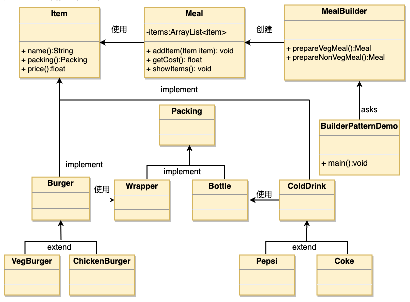

# 1. 5-建造者模式


建造者模式（Builder Pattern）使用**多个简单的对象一步一步构建成一个复杂的对象**。这种类型的设计模式属于创建型模式，它提供了一种创建对象的最佳方式。

一个 Builder 类会一步一步构造最终的对象。**该 Builder 类是独立于其他对象的**。

## 1.1. 介绍

标题 | 说明
---|---
意图 | 将一个复杂的构建与其表示相分离，使得同样的构建过程可以创建不同的表示。
主要解决 | 在软件系统中，有时候面临着"一个复杂对象"的创建工作，其通常由各个部分的子对象用一定的算法构成；由于需求的变化，这个复杂对象的各个部分经常面临着剧烈的变化，但是将它们组合在一起的算法却相对稳定。
何时使用 | 一些**基本部件不会变，而其组合经常变化的时候**。
如何解决 | 将变与不变分离开。
关键代码 | **建造者：创建和提供实例，导演：管理建造出来的实例的依赖关系**。
应用实例 |  1、去肯德基，汉堡、可乐、薯条、炸鸡翅等是不变的，而其组合是经常变化的，生成出所谓的"套餐" <br> 2、JAVA 中的 StringBuilder。
优点 | 1、建造者独立，易扩展。<br>  2、便于控制细节风险。
缺点 |  1、产品必须有共同点，范围有限制。 <br> 2、如内部变化复杂，会有很多的建造类。
使用场景 |  1、需要生成的对象**具有复杂的内部结构**。<br>  2、需要生成的**对象内部属性本身相互依赖**。
注意事项 | 与工厂模式的区别是：**建造者模式更加关注与零件装配的顺序**。

## 1.2. 实现

我们假设一个快餐店的商业案例，其中，一个典型的套餐可以是一个汉堡（Burger）和一杯冷饮（Cold drink）。汉堡（Burger）可以是素食汉堡（Veg Burger）或鸡肉汉堡（Chicken Burger），它们是包在纸盒中。冷饮（Cold drink）可以是可口可乐（coke）或百事可乐（pepsi），它们是装在瓶子中。

我们将创建一个表示食物条目（比如汉堡和冷饮）的 Item 接口和实现 Item 接口的实体类，以及一个表示食物包装的 Packing 接口和实现 Packing 接口的实体类，汉堡是包在纸盒中，冷饮是装在瓶子中。

然后我们创建一个 Meal 类，带有 Item 的 ArrayList 和一个通过结合 Item 来创建不同类型的 Meal 对象的 MealBuilder。BuilderPatternDemo 类使用 MealBuilder 来创建一个 Meal。



### 1.2.1. 食物接口及包装接口

#### 1.2.1.1. 食物条目接口

* Item.java

```java
public interface Item {
   public String name();
   public Packing packing();
   public float price();
}
```


#### 1.2.1.2. 食物包装接口

* Packing.java

```java
public interface Packing {
   public String pack();
}
```

### 1.2.2. 包装接口的实现

创建实现 Packing 接口的实体类。

* Wrapper.java

```java
public class Wrapper implements Packing {
   @Override
   public String pack() {
      return "Wrapper";
   }
}
```

* Bottle.java

```java
public class Bottle implements Packing {
   @Override
   public String pack() {
      return "Bottle";
   }
}
```

### 1.2.3. 食物接口的实现

#### 1.2.3.1. 抽象实现

> 食物在进行包装时，包装模式固定，所以没有必要让每一个食物的具体实现类再去处理包装事件，因为在这里做了一层抽象。

创建实现 Item 接口的抽象类，该类提供了默认的功能。

* Burger.java

```java
public abstract class Burger implements Item {
   @Override
   public Packing packing() {
      return new Wrapper();
   }

   @Override
   public abstract float price();
}
```

* ColdDrink.java

```java
public abstract class ColdDrink implements Item {
    @Override
    public Packing packing() {
       return new Bottle();
    }

    @Override
    public abstract float price();
}
```

#### 1.2.3.2. 具体实现

创建扩展了 Burger 和 ColdDrink 的实体类。

* VegBurger.java

```java
public class VegBurger extends Burger {

   @Override
   public float price() {
      return 25.0f;
   }

   @Override
   public String name() {
      return "Veg Burger";
   }
}
```

* ChickenBurger.java

```java
public class ChickenBurger extends Burger {

   @Override
   public float price() {
      return 50.5f;
   }

   @Override
   public String name() {
      return "Chicken Burger";
   }
}
```

* Coke.java

```java
public class Coke extends ColdDrink {

   @Override
   public float price() {
      return 30.0f;
   }

   @Override
   public String name() {
      return "Coke";
   }
}
```

* Pepsi.java

```java
public class Pepsi extends ColdDrink {

   @Override
   public float price() {
      return 35.0f;
   }

   @Override
   public String name() {
      return "Pepsi";
   }
}
```

### 1.2.4. 进餐（meal）

> 选餐、计算价格、展示已选餐品

创建一个 Meal 类，带有上面定义的 Item 对象。

* Meal.java

```java
import java.util.ArrayList;
import java.util.List;

public class Meal {
   private List<Item> items = new ArrayList<Item>();

   public void addItem(Item item){
      items.add(item);
   }

   public float getCost(){
      float cost = 0.0f;
      for (Item item : items) {
         cost += item.price();
      }
      return cost;
   }

   public void showItems(){
      for (Item item : items) {
         System.out.print("Item : "+item.name());
         System.out.print(", Packing : "+item.packing().pack());
         System.out.println(", Price : "+item.price());
      }
   }
}
```

### 1.2.5. meal 的建造者

> 建造食物套餐

创建一个 MealBuilder 类，实际的 builder 类负责创建 Meal 对象。

* MealBuilder.java

```java
public class MealBuilder {

   public Meal prepareVegMeal (){
      Meal meal = new Meal();
      meal.addItem(new VegBurger());
      meal.addItem(new Coke());
      return meal;
   }

   public Meal prepareNonVegMeal (){
      Meal meal = new Meal();
      meal.addItem(new ChickenBurger());
      meal.addItem(new Pepsi());
      return meal;
   }
}
```

### 1.2.6. 使用建造者

BuiderPatternDemo 使用 MealBuilder 来演示建造者模式（Builder Pattern）。

* BuilderPatternDemo.java

```java
public class BuilderPatternDemo {
   public static void main(String[] args) {
      MealBuilder mealBuilder = new MealBuilder();

      Meal vegMeal = mealBuilder.prepareVegMeal();
      System.out.println("Veg Meal");
      vegMeal.showItems();
      System.out.println("Total Cost: " +vegMeal.getCost());

      Meal nonVegMeal = mealBuilder.prepareNonVegMeal();
      System.out.println("\n\nNon-Veg Meal");
      nonVegMeal.showItems();
      System.out.println("Total Cost: " +nonVegMeal.getCost());
   }
}
```

执行程序，输出结果：

```
Veg Meal
Item : Veg Burger, Packing : Wrapper, Price : 25.0
Item : Coke, Packing : Bottle, Price : 30.0
Total Cost: 55.0


Non-Veg Meal
Item : Chicken Burger, Packing : Wrapper, Price : 50.5
Item : Pepsi, Packing : Bottle, Price : 35.0
Total Cost: 85.5
```

## 1.3. 相关文章

* [原文：建造者(Builder)模式](https://www.runoob.com/design-pattern/builder-pattern.html)
* [设计模式：Builder模式](https://www.runoob.com/w3cnote/builder-pattern-2.html)
* [设计模式（十六）Builder设计模式](https://www.jianshu.com/p/f958ba891467)