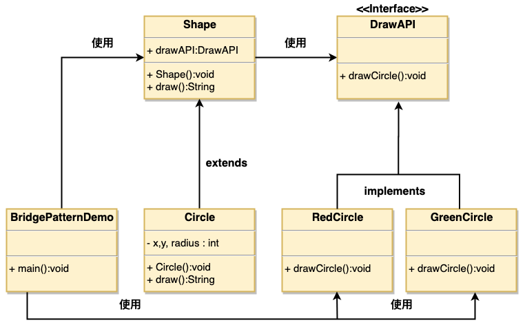

# 1. 8-桥接模式

`桥接`（Bridge）**用于把抽象化与实现化解耦，使得二者可以独立变化**。这种类型的设计模式属于结构型模式，它通过提供抽象化和实现化之间的桥接结构，来实现二者的解耦。

这种模式**涉及到一个作为`桥接`的`接口`，使得实体类的功能独立于接口实现类**。这两种类型的类可被结构化改变而互不影响。

我们通过下面的实例来演示桥接模式（Bridge Pattern）的用法。其中，可以使用相同的抽象类方法但是不同的桥接实现类，来画出不同颜色的圆。

## 1.1. 介绍

标题|说明
---|---
意图 | **将抽象部分与实现部分分离，使它们都可以独立的变化**。
主要解决 | 在有多种可能会变化的情况下，用继承会造成类爆炸问题，扩展起来不灵活。
何时使用 | 实现系统可能有多个角度分类，每一种角度都可能变化。
如何解决 | 把这种多角度分类分离出来，让它们独立变化，减少它们之间耦合。
关键代码 | **抽象类依赖实现类**。
应用实例 | 1、猪八戒从天蓬元帅转世投胎到猪，转世投胎的机制将尘世划分为两个等级，即：灵魂和肉体，前者相当于抽象化，后者相当于实现化。生灵通过功能的委派，调用肉体对象的功能，使得生灵可以动态地选择。 <br> 2、墙上的开关，可以看到的开关是抽象的，不用管里面具体怎么实现的。
优点 | 1、抽象和实现的分离。 <br> 2、优秀的扩展能力。<br>  3、实现细节对客户透明。
缺点 | 桥接模式的引入会增加系统的理解与设计难度，由于聚合关联关系建立在抽象层，要求开发者针对抽象进行设计与编程。
使用场景 | 1、如果一个系统需要在构件的抽象化角色和具体化角色之间增加更多的灵活性，避免在两个层次之间建立静态的继承联系，通过桥接模式可以使它们在抽象层建立一个关联关系。<br>  2、对于那些不希望使用继承或因为多层次继承导致系统类的个数急剧增加的系统，桥接模式尤为适用。 3、一个类存在两个独立变化的维度，且这两个维度都需要进行扩展。
注意事项 | 对于两个独立变化的维度，使用桥接模式再适合不过了。

## 1.2. 实现

我们有一个作为桥接实现的 DrawAPI 接口和实现了 DrawAPI 接口的实体类 RedCircle、GreenCircle。

Shape 是一个抽象类，将使用 DrawAPI 的对象。

BridgePatternDemo 类使用 Shape 类来画出不同颜色的圆。




### 1.2.1. 桥接接口

创建桥接实现接口 DrawAPI。

* DrawAPI.java

```java
public interface DrawAPI {
   public void drawCircle(int radius, int x, int y);
}
```

### 1.2.2. 桥接接口的实现类

创建实现了 DrawAPI 接口的实体**桥接实现类**。

* RedCircle.java

```java
public class RedCircle implements DrawAPI {
   @Override
   public void drawCircle(int radius, int x, int y) {
      System.out.println("Drawing Circle[ color: red, radius: "
         + radius +", x: " +x+", "+ y +"]");
   }
}
```

* GreenCircle.java

```java
public class GreenCircle implements DrawAPI {
   @Override
   public void drawCircle(int radius, int x, int y) {
      System.out.println("Drawing Circle[ color: green, radius: "
         + radius +", x: " +x+", "+ y +"]");
   }
}
```

### 1.2.3. 包含桥接接口的抽象类

使用 DrawAPI 接口创建抽象类 Shape。

* Shape.java

```java
public abstract class Shape {
   protected DrawAPI drawAPI;

   protected Shape(DrawAPI drawAPI){
      this.drawAPI = drawAPI;
   }
   public abstract void draw();
}
```

### 1.2.4. 抽象类的实现类

创建实现了 Shape 抽象类的实体类。

* Circle.java

```java
public class Circle extends Shape {
   private int x, y, radius;

   public Circle(int x, int y, int radius, DrawAPI drawAPI) {
      super(drawAPI);
      this.x = x;
      this.y = y;
      this.radius = radius;
   }

   public void draw() {
      drawAPI.drawCircle(radius,x,y);
   }
}
```

### 1.2.5. 使用实体类

使用 Shape 和 DrawAPI 类画出不同颜色的圆。

* BridgePatternDemo.java

```java
public class BridgePatternDemo {
   public static void main(String[] args) {
      Shape redCircle = new Circle(100,100, 10, new RedCircle());
      Shape greenCircle = new Circle(100,100, 10, new GreenCircle());

      redCircle.draw();
      greenCircle.draw();
   }
}
```

执行程序，输出结果：

```
Drawing Circle[ color: red, radius: 10, x: 100, 100]
Drawing Circle[  color: green, radius: 10, x: 100, 100]
```