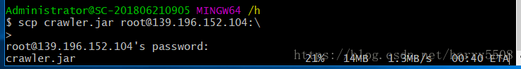
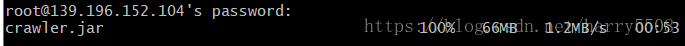
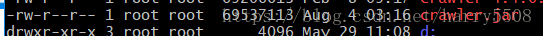

# 1. 0001-scp拷贝

用于本地和服务器之间的文件交互。

## 1.1. 命令解析

### 1.1.1. 上传本地文件到服务器：

```bash
scp /path/filename username@servername:/path/
```

比如下面我要传输 `/h` 目录下的 `crawler.jar` 文件到远程服务器 `root...`（服务器地址省略）的根目录上，就是如下语句：



这是上传成功之后的样子：



进入服务器可以看到：




### 1.1.2. 从服务器上下载文件

下载文件我们经常使用 `wget`，但是如果没有 http 服务，如何从服务器上下载文件呢？

```bash
scp username@servername:/path/filename /var/www/local_dir（本地目录）
```

例如

```
scp root@192.168.0.101:/var/www/test.txt 
```

把 192.168.0.101 上的 `/var/www/test.txt` 的文件下载到 `/var/www/local_dir`（本地目录）

### 1.1.3. 从服务器下载整个目录

```bash
scp -r username@servername:/var/www/remote_dir/（远程目录） /var/www/local_dir（本地目录）
```

例如:

```bash
scp -r root@192.168.0.101:/var/www/test /var/www/
```


### 1.1.4. 上传目录到服务器

```bash
scp -r local_dir username@servername:remote_dir
```

例如：

```bash
scp -r test root@192.168.0.101:/var/www/
```

把当前目录下的 `test` 目录上传到服务器的 `/var/www/` 目录

## 1.2. 附

参考：[使用ssh的scp命令上传文件/目录到远程服务器](https://blog.csdn.net/harry5508/article/details/81406750)
