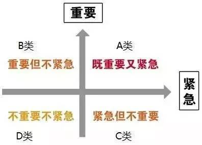

## 5.1 为什么需要进行时间管理

* 可以增强时间观念，从而预防和克服拖延症。
* 可以更高效的完成自己的工作或学习任务, 避免落入“事事紧急，疲于应付”的窘境。
* 可以合理规划时间，让自己拥有充足的个人休闲时间。
* 可以加强日程管理能力和执行力。
* 可以避免无意义的努力，让你离成功更近。

## 5.2 如何进行时间管理

### 5.2.1 四象限管理法

时间管理中最重要的一个方法就是：四象限管理法。其示意图如下：

上图中，将事情或任务按照重要程度和紧急程度划分为四大模块：`重要且紧急`、`重要但不紧急`、`紧急但不重要`、`不重要也不紧急`。

* `重要且紧急`：这类事情具有时间的紧迫性和影响的重要性，无法回避也不能拖延。
* `重要但不紧急`：这类事情不具有时间上的紧迫性，但却具有重大的影响或收益，对于个人或者企业的发展都具有重大意义。
* `紧急但不重要的事情`：这类事情虽然紧急但并不重要，我们必须认真权衡，仔细考量是否有必要去做这类事情，避免占用过多的时间。
* `不重要也不紧急`：这类事情没有时间的紧迫性，也没有任何的重要性，多是一些琐碎的事情。比如发呆、闲聊、游逛等。

### 5.2.2 四象限管理法的基本理念

`四象限管理法` 的基本理念是：**我们应该把主要的精⼒和时间放在处理那些重要但不紧急的工作上，从而做到未⾬绸缪，防患于未然。** 在此基础上，我们要优先处理那些 `紧急且重要` 的事情，合理衡量 `紧急但不重要` 的事情，不处理那些 `不重要也不紧急` 的事情。

### 5.2.3 基于四象限管理法的事情处理策略

* `重要且紧急` 的事情 : 优先处理，并设法减少这类事情。
* `重要但不紧急` 的事情：做好计划，按计划逐步推进，并防止其变为 `重要且紧急` 的事情。
* `紧急但不重要` 的事情：合理衡量是否有处理该事情的必要性，如果确实需要做，条件允许的话可将权利下方，授权给他人去做。
* `不重要也不紧急` 的事情：尽量少做或者不要做此类事情。
 


