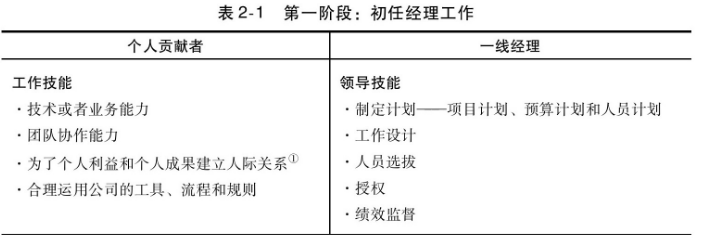
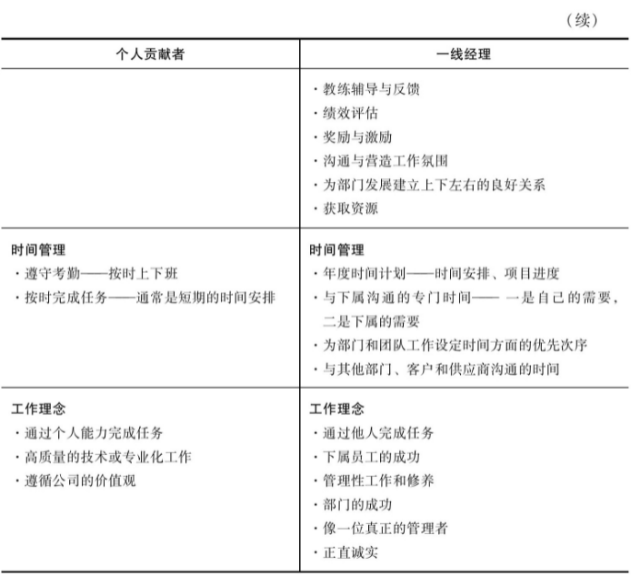
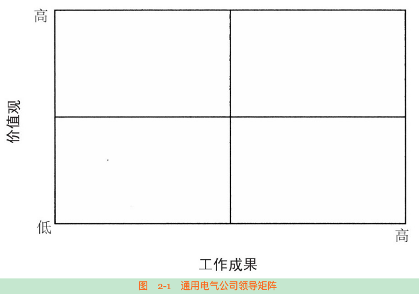

# 1. 1-《领导梯队》

《领导梯队：全面打造领导力驱动型公司（原书第2版）》
作者:（美）拉姆·查兰（Ram Charan），（美）斯蒂芬·德罗特（Stephen Drotter），（美）詹姆斯·诺埃尔（James Noel）

拉姆·查兰 的其他相关作品：《高效的董事会》、Owning Up、《逆转力——经济不确定时代的新领导法则》、《卓越领导者的8项技能》、《首席执行官想要你知道的事》

## 1.1. 总序 领导梯队建设：跨越从优秀到卓越的天堑

企业持续成长需要经历**市场驱动型成长、创新驱动型成长和领导力驱动型成长**三个阶段。

人才的培养70%来自“岗位锻炼”，20%来自“人际学习”，10%来自“课堂培训”

领导梯队建设包含以下三个层次：

* 第一个层次是领导梯队建设的体系模式，包括企业的人才理念、战略、结构、政策、制度和流程。
* 第二个层次是领导梯队建设的系统方法，即领导人才培养的操作手册
* 第三个层次是领导梯队建设的实战工具，这是中国企业领导人才培养中普遍存在的“短板

判断一个企业家是否伟大的标准绝不仅仅是看他在任时公司的业绩，更重要的是他离任后公司的发展，而这主要取决于他对各级领导人才和未来接班人的培养。”

在一个等级制度中，每个员工趋向于上升到他所不能胜任的地位。

“领导梯队模型”将从员工成长为首席执行官的管理历程划分为六个领导力发展阶段，每一阶段都要掌握特定的领导技能、时间管理能力和工作理念。第一阶段：从管理自我到管理他人，重点是从自己做事转变为带队伍做事这个工作理念的转变；第二阶段：从管理他人到管理经理人员，关键的领导技能是教练选拔人才担任一线经理；第三阶段：从管理经理人员到管理职能部门，需要学会新的沟通技巧以跨越两个层级与员工进行沟通；第四阶段：从管理职能部门到事业部总经理，重点是转变思考方式，从赢利和长远发展的角度评估计划和方案；第五阶段：从事业部总经理到集团高管，必须擅长评估资金调拨和人员配置的战略规划；第六阶段：从集团高管到首席执行官，必须具备重视外部关系的视角

只有建立起领导梯队模型，才能有效地整合领导力培训项目、继任计划、绩效管理和薪酬福利。

领导梯队模型：既关注现在，又着眼未来

人力资源部在领导梯队建设中扮演着关键角色，但主要是这项工程的设计师，而不是执行者。各级领导才是执行者，他们做出判断，并对成败负责。人力资源部门对领导梯队的架构设计、运用、评价和质量负责。

发现和培养领导人才面临的困境：新经济、全球化和公司视野

确保领导者所在的领导层级与其领导技能、时间管理能力和工作理念相符，对于公司而言是一项挑战

为了在所有层级建立有效的领导梯队，公司需要尽早确定各级领导者的潜在人选，为他们安排成长所需的工作任务，给予他们有效的反馈意见，并且对他们进行教练辅导

## 1.2. 领导力发展的六个阶段

### 1.2.1. 六个阶段

#### 1.2.1.1. 第一阶段：从管理自我到管理他人

他们学习的内容包括工作计划、进度管理、工作内容、工作质量和工作的可靠性，需要提高的工作价值观包括公司文化和职业标准

在领导力发展的第一阶段，应该学习的技能包括工作计划、知人善任、分配工作、激励员工、教练辅导和绩效评估。一线经理需要学会如何管理他们的时间，使得他们不仅能够完成自己的工作，同时还能够帮助其他人完成工作

们必须把通过他人完成任务作为自己取得成功的关键

#### 1.2.1.2. 第二阶段：从管理他人到管理经理人员

与第一阶段工作最大的不同是，第二阶段是纯粹的管理工作。在第一阶段，经理人员仍然要承担一部分个人贡献。但在第二阶段，他们不再需要直接做出个人贡献。他们必须掌握的关键技能包括选拔人才担任一线经理，分配管理工作，评估下属经理以及教练辅导。同时，他们必须学会超越部门利益考虑全局性战略问题，并积极地给予支持。

#### 1.2.1.3. 第三阶段：从管理经理人员到管理职能部门

是事业部副总经理，同时主管几个相关部门，他们需要跨越两个层级与员工沟通，因此需要培养新的沟通技巧。此外，他们还必须管理自身专业以外的其他工作，这就意味着他们必须懂得专业以外的工作，而且还必须学会评估它的价值。

，他们必须有全局意识，能够兼顾多个部门的需求和利益。他们需要具备两项新的技能：一方面是与其他部门团结协作，另一方面是基于工作的需要与其他部门争夺资源。与此同时，他们还必须擅长制定战略，不仅为自己的部门，而且统筹整个业务部门的战略规划。他们需要经常参加业务工作会议，与其他部门主管并肩作战。这些工作都需要占用他们的时间，因此，他们必须学会适当授权给下属经理。

在这个管理层级，他们的领导能力主要体现在制定职能战略，以确保业务领先于竞争对手

#### 1.2.1.4. 第四阶段：从管理职能部门到事业部总经理

，事业部总经理不是从部门的角度评估计划和建议方案，而是从赢利和长远发展的角度进行评估。

要学会管理不同的部门，而且需要熟练地与各方面的人员协同工作，敏锐地意识到各部门的利益点，并清楚、有效地与各方面人员沟通。更具挑战性的是，如何兼顾长远目标与近期目标，取得恰当的平衡。事业部总经理必须完成季度利润、市场目标、产品计划和人员管理目标，同时兼顾未来3～5年目标的实现。

不需要每天去做具体的工作，而应该把更多的时间用于分析和反思。

#### 1.2.1.5. 第五阶段：从事业部总经理到集团高管

这个阶段要求领导者在四项关键技能方面进一步提升。第一项技能是，集团高管必须擅长评估资金调拨和人员配置的战略规划。这是一项复杂的商业技能，包括学会正确的提问，有效地分析数据，以及从公司的角度去理解哪些战略规划最有可能成功，最应该得到支持。

第二项技能是培养事业部总经理。他需要清楚哪些事业部副总经理的能力最适合担任事业部总经理，并提升自己的教练辅导能

第三项技能是评估业务的投资组合策略。这与事业部的战略有很大不同。他第一次需要问以下几个问题：我们有合适的业务群吗？为确保当前和未来的赢利，需要增加什么业务？削减哪项业务？调整哪项业务？
第四项技能是集团高管必须精于评估自己的核心能力，采取冷静客观的态度，评估手中的资源，基于分析和经验做出判断，而不是盲目乐观。

#### 1.2.1.6. 第六阶段：从集团高管到首席执行官

领导力发展的第六阶段，其转变更多地集中在经营理念而不是管理技能方面。首席执行官必须确认自己的角色和职责。作为一位组织的最高领导，他必须是一位有着远大抱负的思想者，同时善于建立公司的运行机制，推动公司实现每个季度的业绩目标，并确保公司长期战略目标的实现

此外，敏锐地觉察并熟练地处理外部利益相关者关系、重大的外部变化以及积极主动地加以应对，变得越来越重要。首席执行官必须具备重视外部关系的视角。

首席执行官必须学会“抓大放小”，聚焦于公司全局性事物，例如，如何更好地构思、开发、生产和销售客户真正需要的产品，而不是具体的产品开发细节

### 1.2.2. 领导梯队模型在小公司的应用

必须确保全公司的努力能够创造效益，并实现可持续发展。另一项职责是，基于客户需求和竞争形势，设定公司的发展目标

#### 1.2.2.1. 常见问题：

问：建立一个人才辈出的领导梯队，面临的最大挑战是什么？

* 1领导要学会放权，不要事必躬亲
* 2要学会培养继任者
* 3放眼未来，多考虑公司战略和未来发展

#### 1.2.2.2. 其他

个人贡献者的能力越来越强，期望越来越高

员工希望获得过去被认为是少数人才知道的信息，希望可以参与到决策制定的过程中。同时，他们也希望在工作方式上有一定的自由度。换句话说，在完成任务的过程中，他们既需要指导也需要自由。

## 1.3. 从管理自我到管理他人

### 1.3.1. 初任经理的三项重要工作：

◆界定和布置工作，包括与上司、员工沟通，需要他们做什么，以及工作计划、组织结构、人员选拔和工作授权。

> CnPeng:
> * 提前制定并梳理工作计划，计划内容及时通报给相关人员，定时跟进计划进展，根据实际情况修改计划内容
> * 工作内容下放、下放时选择合适的人做合适的事、及时跟踪和检查下放内容的进展、及时将进展沟通给上级和外部相关人员。
> * 适当进行团建，不限于定时定点的团建。比如中午一起吃饭，也算是一种团建
> * 学会找到与沟通对象的共同点，并放大该共同点
> * 更多的着眼于如何提升团队的工作效率、工作产出和下属能力提升

◆通过监督、指导、反馈、获取资源、解决问题和交流沟通，提高下属的胜任能力，从而高效开展工作。

> CnPeng
> * 下级遇到问题时，协调资源帮助解决问题
> * 引导下级提升能力，
> * 与下级分享经验，教授下级如何正确的做某项工作，给予适当的指导
> * 工作中给予员工更大的自主性

◆建立与下属、上司和相关部门坦率交流与相互信任的合作关系。

> CnPeng
> * 定期与下级进行不限于工作的沟通，增强互相的了解，让员工有归属感，让员工感到上级有亲和力
> * 建立和维系关系时，避免以个人喜好为导向，而是以互惠互利为目标

### 1.3.2. 疏通梯队战术

即如何让初任经理实现顺利转型。

#### 1.3.2.1. 准备：

通过提供必要的转型培训，让初任经理**清楚的知道**胜任岗位的能力要求，包括领导技能、时间管理能力和工作理念。

工作理念对应下图中的价值观。下图中，右上角表示价值观与公司一致，且工作成果突出，这种员工是提拔为经理的最佳候选人。反之，右下角表示价值观不一致，但工作成功突出，这种员工比较危险，其价值观极有可能会抵消其工作成果。

#### 1.3.2.2. 监督：

确认初任经理在转型中是否遇到了困难，困难是什么

评估转型是否成功的三种方式：

* 观察-旁听初任经理与下属的沟通，观察其是否展现出必备的领导技能；
* 调查-通过下属或上级调查初任经理的胜任情况；
* 差距分析-让初任经理对自己的领导能力、时间管理能力和工作理念进行自我评估。

#### 1.3.2.3. 干预

定期提供反馈和教练辅导，帮助初任经理实现转型

* 上司对初任经理的一对一辅导或沟通至关重要，着重提升初任经理的时间管理能力和团队领导力
* 组织经理人相互交流领导技能，交换工作思路和感受，探讨共同关注的问题
* 初任经理人的自我干预，即自我总结、自我反思、自主阅读相关书籍等

### 1.3.3. 常见问题

#### 1.3.3.1. 初任经理人转型不成功的初期迹象有哪些？

* 不能有效的与直接下属合作，包括：
    * 下属很难找到他
    * 必要的会议很少
    * 没有从人性的角度了解员工，缺乏有效沟通
* 无法与上司进行清楚的沟通成功的标准、主要的问题、业务的优先次序等

## 1.4. 从管理他人到管理经理人

即部门总监或者高级经理，他们会管理一些下属一线经理

### 1.4.1. 部门总监的四种领导技能

