# 1. 黑马-HarmonyOS4.0开发应用从入门到实战

基于  B 站[《黑马程序员最新鸿蒙HarmonyOS4.0开发应用从入门到实战视频教程，鸿蒙开发一套通关（含DevEco Studio、ArkTS、ArkUI、鸿蒙项目实战等）》](https://www.bilibili.com/video/BV1Sa4y1Z7B1) 整理

[官网：https://developer.harmonyos.com/ ](https://developer.harmonyos.com/)

## 1.1. 开发准备

>2023-12-01 周五

### 1.1.1. 开发套件

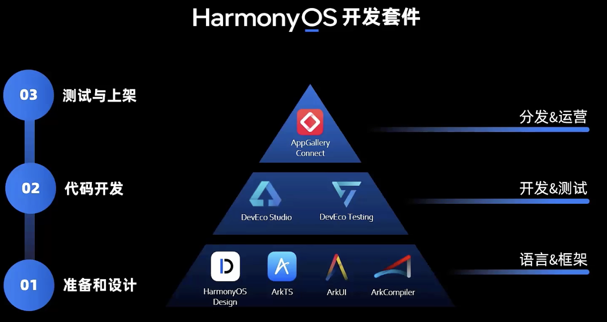


分类|名称 | 说明
---|---|---
语言&框架 |HarmonyOs Design  | 用于做UI视觉设计
语言&框架 | ArkTs | 开发使用的语言
语言&框架 | ArkUI | 开发使用的UI框架
语言&框架 | ArkComplier | 方舟编译器，将代码编译成字节码
开发工具 | DevEco Studio | 开发IDE
测试工具 | DevEco Testing | 开发完成后的测试工具
分发和运行 | App Gallery Connect | 即华为应用市场


本套教程重点关注的是 `ArkTs`、`ArkUI`、`DevEco Studio` 三部分。

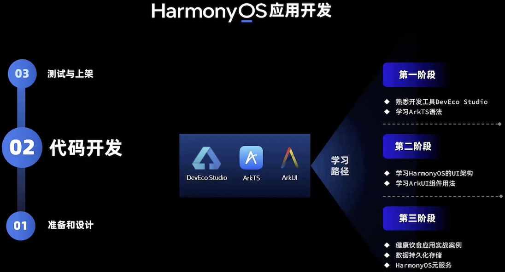

### 1.1.2. 开发文档

[鸿蒙OS官网](https://developer.harmonyos.com/)

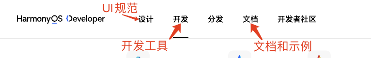


### 1.1.3. 开发工具

> 以 Mac 电脑为例。

#### 1.1.3.1. 下载

[DevEco Studio 下载](https://developer.harmonyos.com/cn/develop/deveco-studio/#download)

#### 1.1.3.2. 初次运行

安装完成后，初次运行时，需要选择或安装 `Node.js`、`Ohpm`(即：OpenHarmonyPackageManager)。

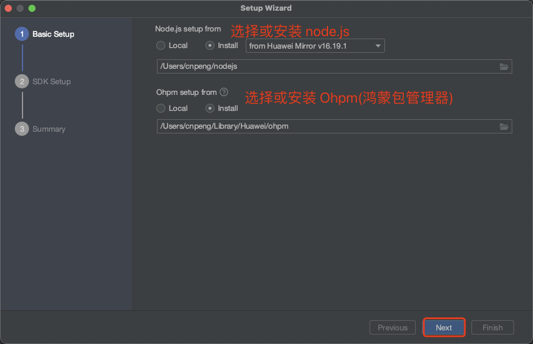

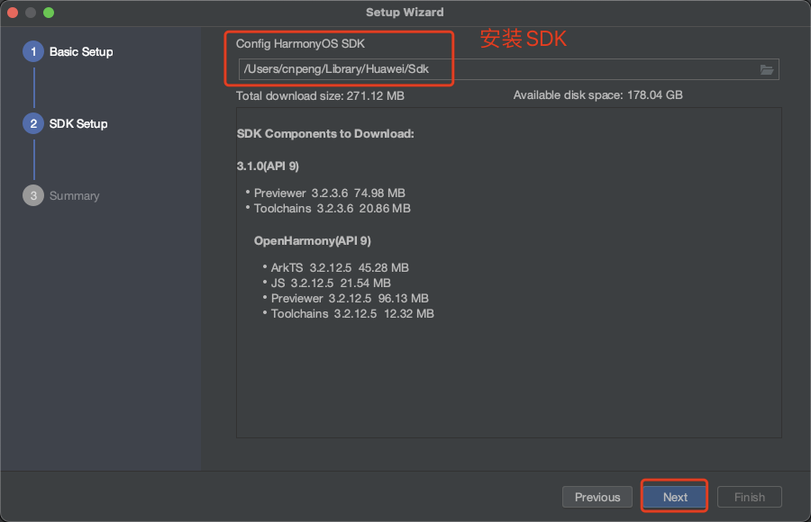

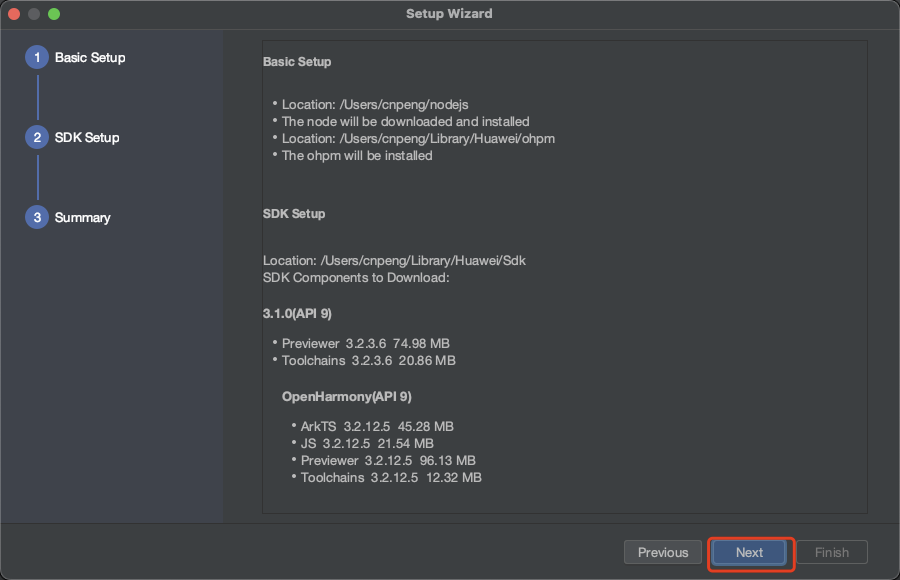

#### 1.1.3.3. Ohpm 安装失败的解决

> CnPeng ：
> 1、在下面的报错图片中，我们已经知道是因为权限被拒绝，具体错误原因为：`EACCES：permission deied,mkdir ‘/Users/cnpeng/.npm/_cache/index-v5/c7/5d’` ，最简单且彻底的解决办法其实是后面 《快速入门/helloworld/SDK缺失的解决》中的办法，使用 `sudo chown -R 用户名 /目录名/` 修改 `.npm` 目录的权属用户为非 root 的普通用户。
> 
> 2、按照此处手动安装的方式虽然能解决 ohpm 安装的问题，但如果不解决 `.npm` 目录的权属问题，后面运行项目时依旧会出现无法安装 SDK 的问题，所以，还是直接修改 `.npm` 的权属用户吧。

##### 1.1.3.3.1. 问题现象

在初次运行过程中，点击上一小节最后的 `next` 按钮后可能会出现下面的报错：

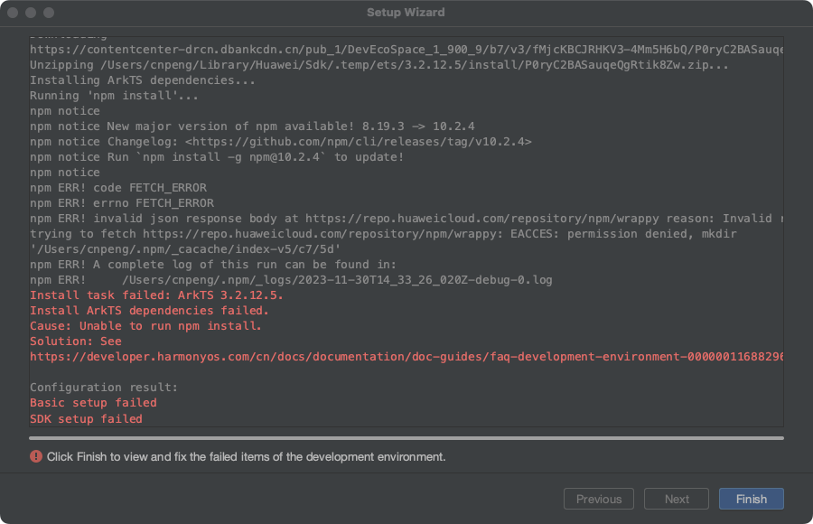

按照提示点击 `Finish` 后进入如下页面：

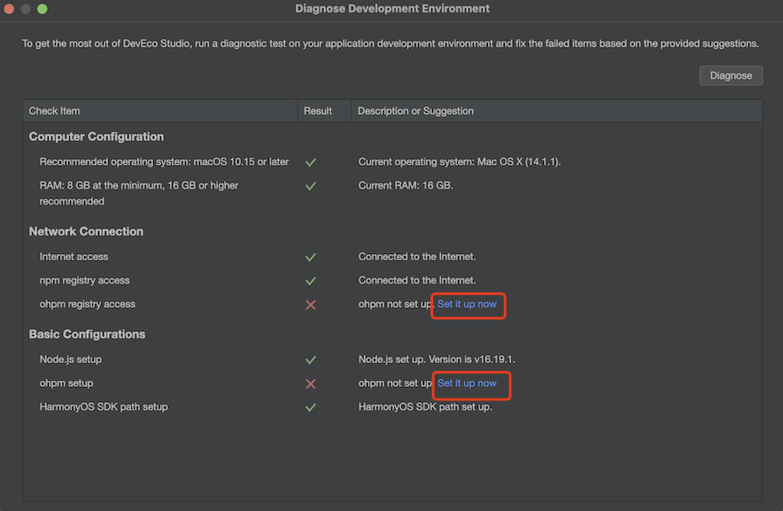

此时，我们先点击蓝色字体的 `Set it up now`，依旧选择从网络安装，如下图：

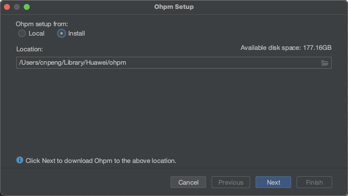

但依旧安装失败：

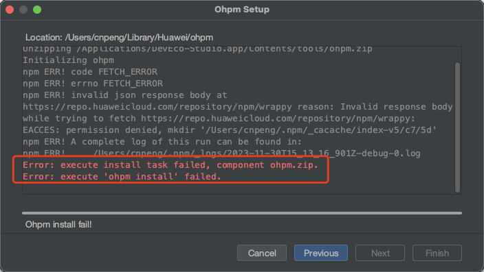

##### 1.1.3.3.2. 解决方案

> 以 Mac 电脑为例。

###### 1.1.3.3.2.1. 下载

点击进入 [【Command Line Tools for OpenHarmonyOS】](https://developer.harmonyos.com/cn/develop/deveco-studio#download_cli) 的下载页面，基于电脑选择对应的版本：

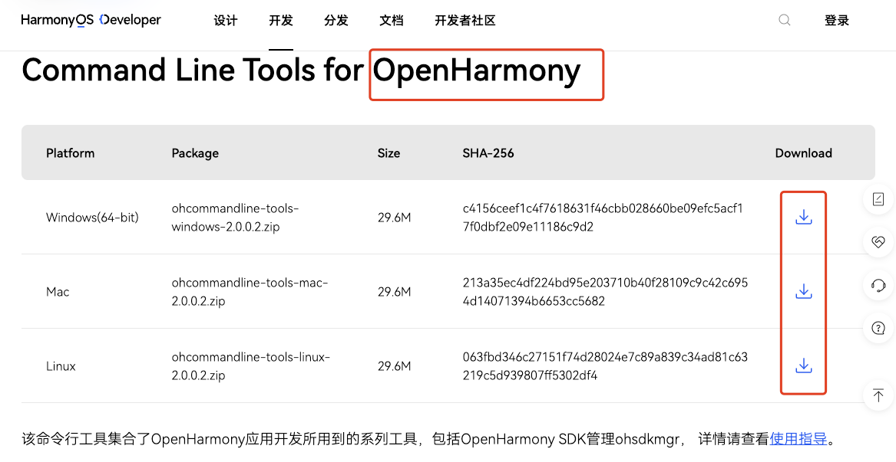

###### 1.1.3.3.2.2. 安装Ohpm

将下载下来的 Zip 文件解压，如下图：

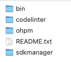

打开 `终端`，输入 ``然后进入上面的 `ohpm/bin` 目录，然后执行 `bin` 目录下的 `init` 文件（在`终端`中输入 `./init` 并回车）：

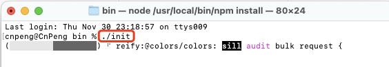

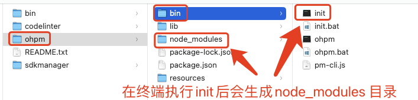

执行完成后，将整个 `ohpm` 目录拷贝到：`/Users/你的电脑用户名/Library/Huawei/` 中（如果初次运行成功的话，`ohpm` 也是安装在该目录下）。

> Zip 文件和解压缩后的其他目录已经没用了，都可以删除了。


###### 1.1.3.3.2.3. 在 DevEco 中配置

此时我们再回到下面的界面中，选择 `Local`，并选择解压文件目录中的 `ohpm` 目录：

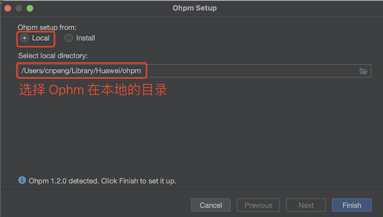

点击 `Finish` 后，等待执行完成，然后会看到如下界面：

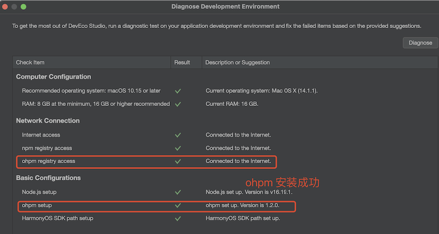

至此，`ohpm` 安装成功并配置完成，现在就可以进行开发了。

> 前面下载的 Zip 文件可以删除了。但是解压后的文件夹必须要保留，否则重启电脑后再次运行时还是会出现 Ophm 安装失败的现象。


##### 1.1.3.3.3. 补充1:开发环境诊断

参考：[配置开发环境-诊断开发环境](https://developer.harmonyos.com/cn/docs/documentation/doc-guides-V3/environment_config-0000001052902427-V3#section1912218441119)

若在手动安装 `ohpm` 过程中，不小心关闭了 `Diagnose Development Environment` 界面，导致无法进入 `Ohpm Setup` 界面，我们可以在 `DevEco Studio` 欢迎页中找到其入口，如下：

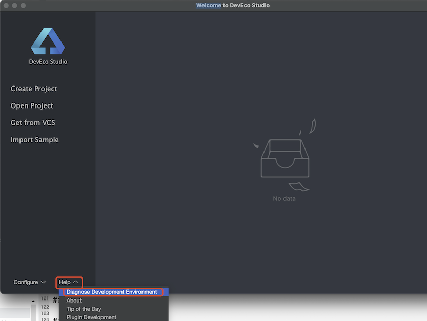

如果不小心关闭了 `DevEco Studio`，重新打开并按照上图进行选择即可。

##### 1.1.3.3.4. 补充2:ohpm安装

在出现 `ohpm` 安装失败的情况时，如果我们通过 `访达/应用程序/DevEco-Studio/显示包内容` 进入到 `DevEco-Studio` 应用内，

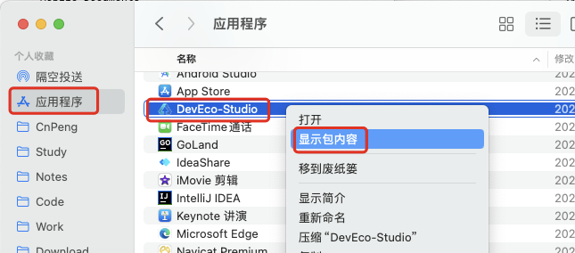

然后在 `Contents/tools` 目录下也可能会发现有一个未解压的 `ohpm.zip` 文件，如下图：

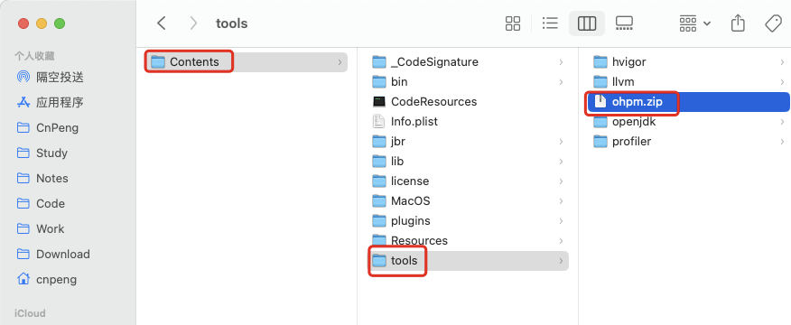

我们也可以将该文件拷贝出来，然后解压，执行其中的 `/bin/init` 文件，再将执行完后的 `ohpm` 目录移到 `/Users/你的电脑用户名/Library/Huawei/` 中。

注意：执行后的 `ohpm` 不要直接放在 `Contents/tools/` 目录下，因为在 `Ohpm Setup` 界面中无法选择该目录。

##### 1.1.3.3.5. 参考

[《ohpm使用指导》(含ohpm的安装、更改配置、常用命令等)](https://developer.harmonyos.com/cn/docs/documentation/doc-guides-V3/ide-command-line-ohpm-0000001490235312-V3?ha_linker=eyJ0cyI6MTY5MTIwNTAyNDI2NSwiaWQiOiIzNGU0MzQ0MzdhNTQwMzZiMWYyYjVkMmI0MmIxYWZhZSJ9&ha_linker=eyJ0cyI6MTY5MTU3MDIwMjU4NiwiaWQiOiJjMGJlYmQ3YzZmZmNkZmI4MjZlMzY4NWU4OTNhNGE2ZCJ9)


#### 1.1.3.4. 配置Ohpm环境变量

参考 [《ohpm使用指导》(含ohpm的安装、更改配置、常用命令等)](https://developer.harmonyos.com/cn/docs/documentation/doc-guides-V3/ide-command-line-ohpm-0000001490235312-V3?ha_linker=eyJ0cyI6MTY5MTIwNTAyNDI2NSwiaWQiOiIzNGU0MzQ0MzdhNTQwMzZiMWYyYjVkMmI0MmIxYWZhZSJ9&ha_linker=eyJ0cyI6MTY5MTU3MDIwMjU4NiwiaWQiOiJjMGJlYmQ3YzZmZmNkZmI4MjZlMzY4NWU4OTNhNGE2ZCJ9)

以 Mac 为例，

先找到 `ohpm` 的安装目录（ 默认为 `/Users/你的电脑用户名/Library/Huawei/ohpm` ）,

然后打开`终端`，并依次执行如下命令：

```bash
export OHPM_HOME=/Users/你的电脑用户名/Library/Huawei/ohpm  #本处路径请替换为ohpm的安装路径
export PATH=${OHPM_HOME}/bin:${PATH}
```

执行完成后，再执行：

```bash
ohpm -v
```

如果显示版本号，则表示 `ohpm` 的环境变量配置成功。

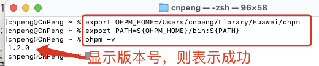

#### 1.1.3.5. 设置为中文

##### 1.1.3.5.1. 进入设置界面

有两种方式：

* 方式1：通过点击状态栏中的 `DevEco Studio`，然后选择 `Settings`

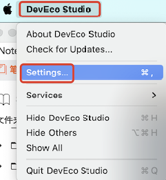

* 方式2：在 `DevEco Studio` 欢迎页左下方，点击 `Configure`-`Plugins`

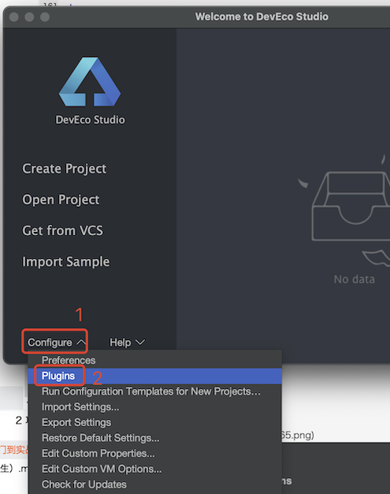

##### 1.1.3.5.2. 启用中文插件

该中文插件默认已经安装，但默认是禁用的，在搜索框中输入 `chinese` 找到它并启用即可，如下图：

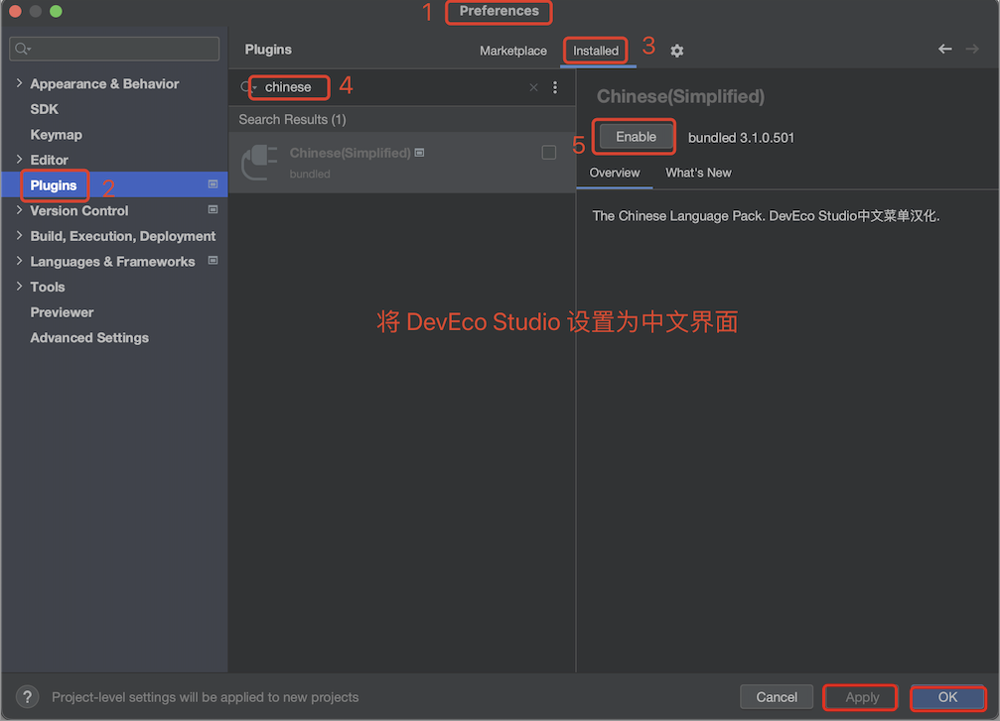


## 1.2. ArkTs 语言特点

>2023-12-01 周五

[视频p3](https://www.bilibili.com/video/BV1Sa4y1Z7B1/?p=3&spm_id_from=pageDriver&vd_source=52532367532c4237b88b472159331d19)

使用网页技术开发手机端页面时，需要同时使用 HTML、CSS、JS 三种语言：

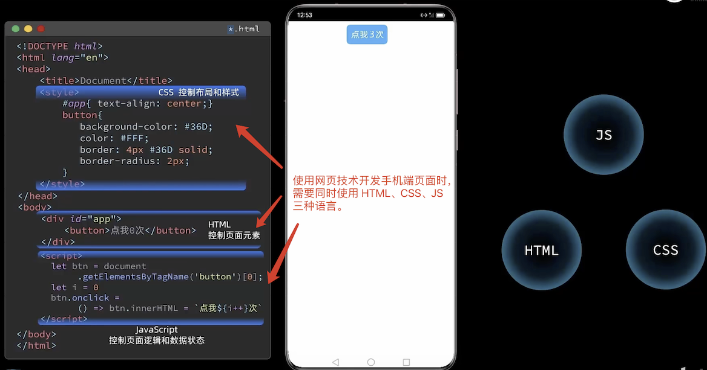

在鸿蒙开发中，我们只需要掌握 ArkTs 语言即可。

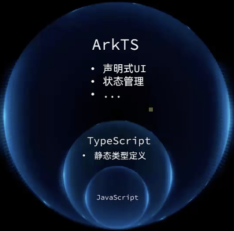

`ArkTs` 基于 `TypeScript` 扩展实现，而 `TypeScript` 又基于 `JavaScript` 扩展实现。 

### 1.2.1. 声明式UI

所谓 `声明式UI` ，就是需要啥就写啥，不需要写其他多余的内容。

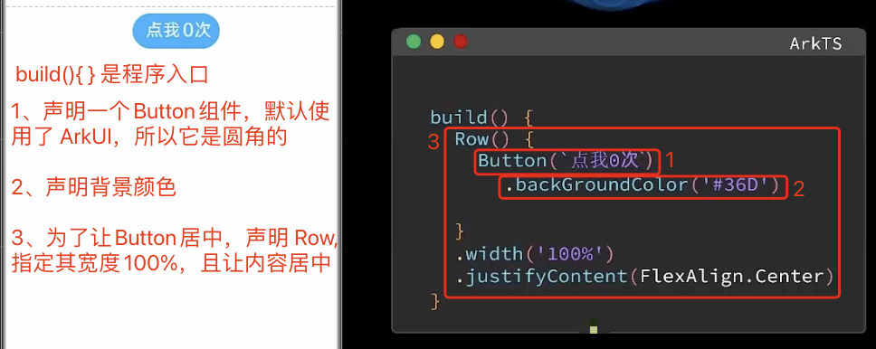

### 1.2.2. 状态管理

关键字 `@State`，被标记的数据发生变化时，会自动渲染到界面上。

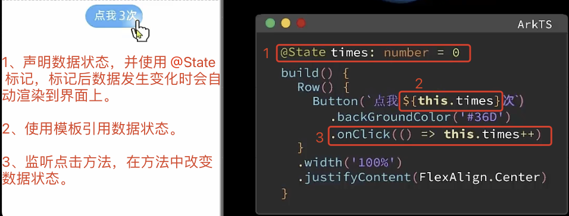

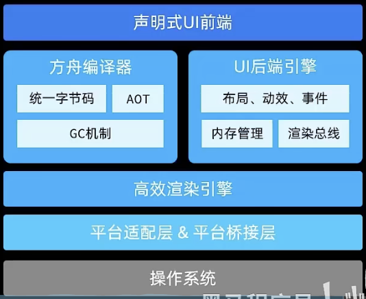

## 1.3. TypeScript基本语法

>2023-12-01 周五

[视频p3](https://www.bilibili.com/video/BV1Sa4y1Z7B1/?p=3&spm_id_from=pageDriver&vd_source=52532367532c4237b88b472159331d19)

点击进入：[TypeScript 官网](https://www.typescriptlang.org/zh/)

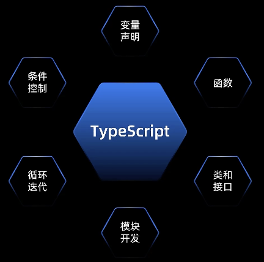

`TypeScript` 在 `JavaScript` 的基础上增加了**静态类型检查**功能，因此每一个变量都必须有固定的数据类型。

### 1.3.1. 变量

```ts
let msg:string = 'hello world'
```

* `let` ：用于声明变量，声明常量时使用 `const`
* `msg`：是变量名称，自定即可。
* `string`：变量的类型。


### 1.3.2. 数据类型

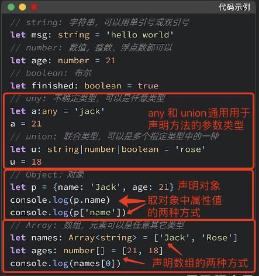

类型 | 说明
---|---
string | 使用单引号或双引号包裹
number | 数值。包含整数、浮点数
boolean | 布尔类型。true 、false 
any | 不确定类型，值可以是任意类型。通常作为方法的参数使用。
union | 联合类型，将多个类型使用 `|` 连接起来。通常作为方法的参数使用。
Object | 对象，使用`{}` 包裹属性及属性值，类似 json 的写法。

在取 Object 对象的属性时，可以使用 `obj.属性名` 形式或 `obj['属性名']` 的形式。

在声明数组时，有两种方式：

```ts
// 使用 Array<类型> 关键字声明数组
let names:Array<string> = ['Jack','Rost']
// 使用 类型[] 声明数组
let ages:number[] = [21,18]
// 取值方式都是使用角标形式（索引形式，索引从 0 开始）
console.log(names[0])
```

补充示例：

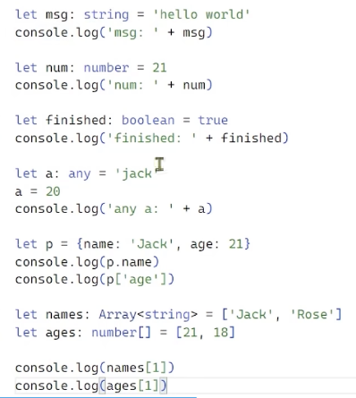


向数组中添加元素：`数组名.push(新的数组元素)`

删除数组中的元素：`数组名.splice(index,num)`，从 `index` 索引开始，删除几个。

替换数组中的元素：`数组名[index] = 新的数组元素`，将 `index` 索引出的元素替换为新的数组元素。


### 1.3.3. 条件控制

TypeScript 与大多数开发语言类似，支持基于 `if-else` 和 `switch` 的条件控制。

#### 1.3.3.1. if 

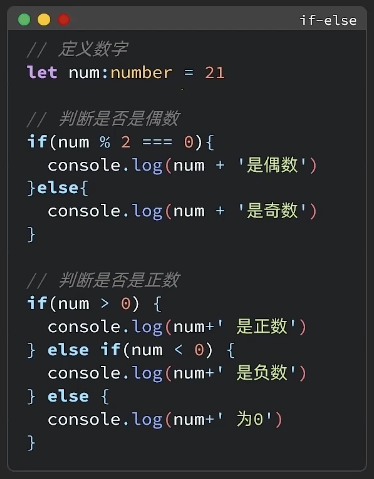

在判断是否相等时，使用了 `===` 。也可以使用 `==`，但不推荐，因为 `==` 在判断时会比较类型是否一致，类型不一致会进行类型转换，执行效率不如 `===` 高。

**注意**📢： **在 TypeScript 中，空字符串、数字0、null、undefined 都被任务是`false`，其他值则为`true`。** 所以，我们在进行 `if` 判断时，可以直接将变量作为判断条件。如：

```ts
if (num){
   // 假设 num 是 number 类型，当 num 非 0 时，num 就表示 true , 代码就会执行到这里。
}
```

其他示例：

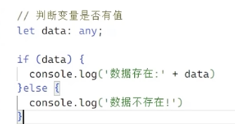


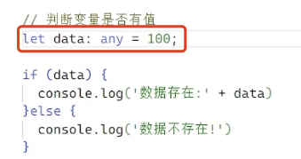


#### 1.3.3.2. switch

 switch 语句的关键字包括：`switch`、`case`、`break`、`default`

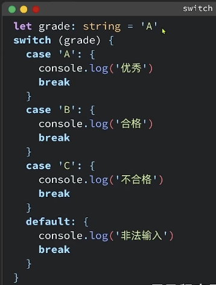

### 1.3.4. 循环迭代

TypeScript 支持 `for` 和 `while` 循环，并为一些内置类型（如 `Arrary` ） 提供了快捷迭代语法。

普通的 `for` 和 `while` 循环：

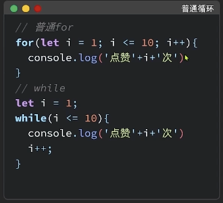

TypeScript 为数组（`Array`）提供了 `for...in` 和 `for...of` 迭代器，如下：

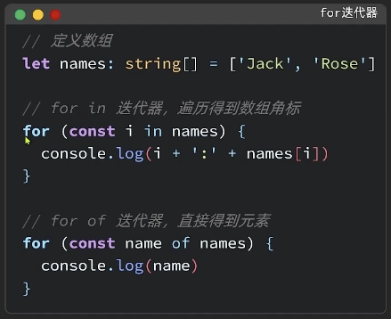

* `for...in` 遍历得到的是元素角标（索引）。
* `for...of` 遍历得到的是元素本身。


### 1.3.5. 函数

TypeScript 通常利用 `function` 关键字来声明函数，并且支持可选参数、默认参数、箭头函数等特殊语法。

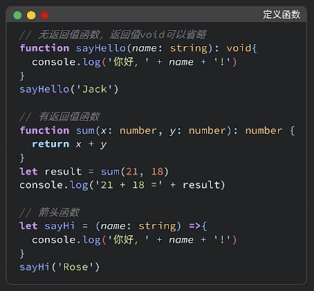

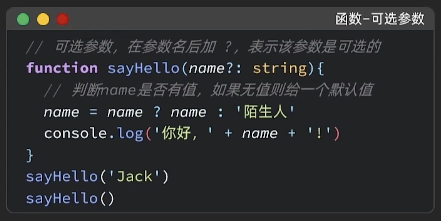

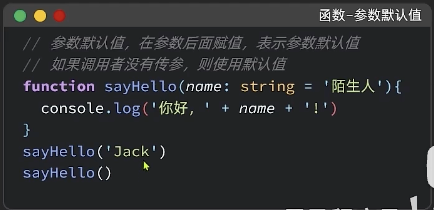


### 1.3.6. 类和接口

TypeScript 具备面向对象编程的基本语法，例如 `interface`、`class`、`enum` 等。也具备 `封装`、`集成`、`多态` 等面向对象的基本特征。

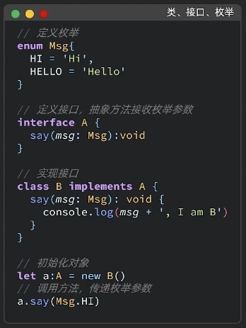

* 枚举项未赋值时，默认是数值类型，第一个枚举项值为 0，后面依次累加。枚举项在赋值时不需要指定数据类型，直接赋值即可。

* 在接口（`interface`）或类（`class`）中定义的方法，不需要使用 `function` 关键字。

其他示例：

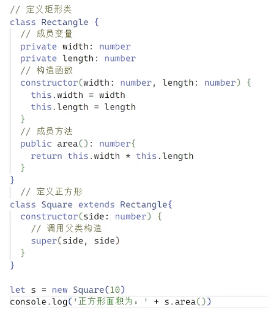

类中定义变量时，不需要使用 `let` 或 `const` , 而是使用 `private`、`public` 。


### 1.3.7. 模块开发

应用比较复杂时，把通用功能抽取到单独的 ts 文件中，每个文件都是一个模块（`module`）。模块可以互相加载，提供代码复用性。

定义模块和方法，并将模块使用 `export` 导出：

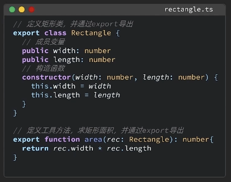

使用 `import` 导入模块及方法，并使用：

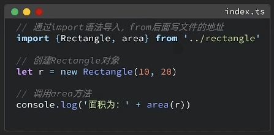

## 1.4. 快速入门

>2023-12-03 周日

[B站视频-p5](https://www.bilibili.com/video/BV1Sa4y1Z7B1/?p=5)

### 1.4.1. helloworld

#### 1.4.1.1. 新建项目

打开 DevEco Studio 新建一个项目：

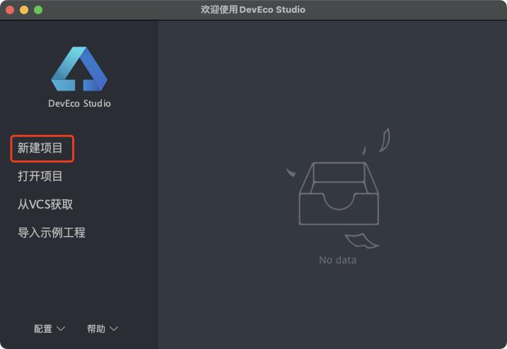

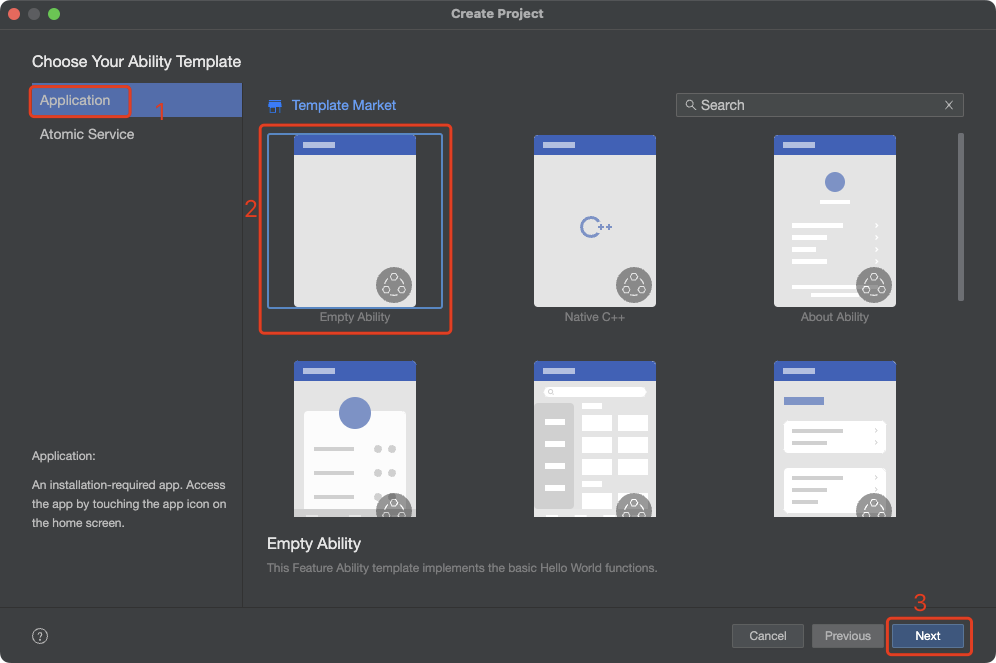

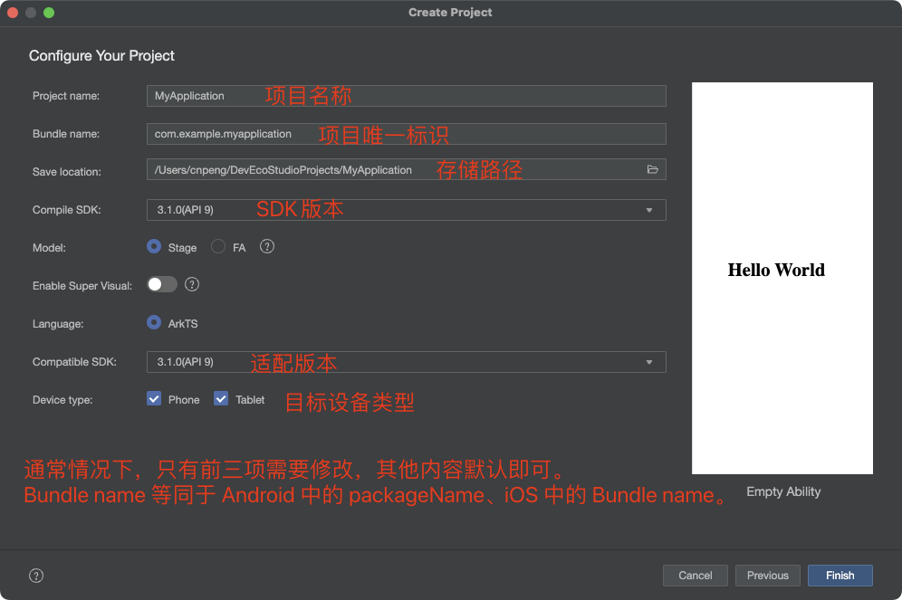

#### 1.4.1.2. SDK 缺失的解决

##### 1.4.1.2.1. 问题现象

如下图，错误提示 `工程同步失败，一些基础功能（如编辑器，调试器）可能失效`：

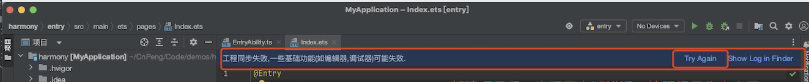


##### 1.4.1.2.2. 解决过程

按照提示，点击 `Try Again`：

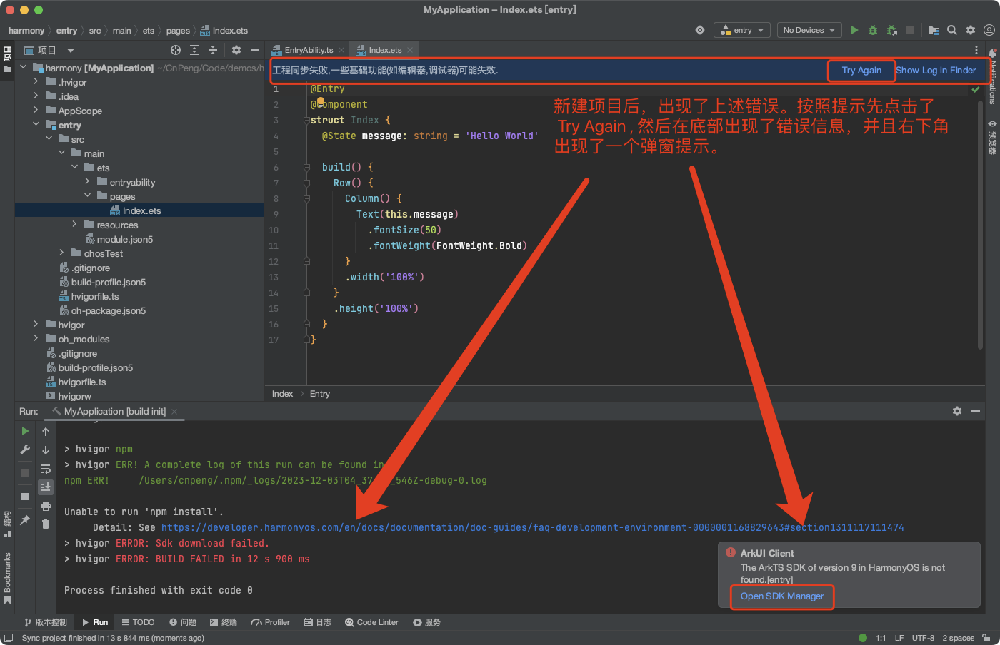

界面底部提示具体的错误原因是 `SDK 缺失`，然后点击弹窗中的 `Open SDK Manager`，打开 `首选项` 页面：

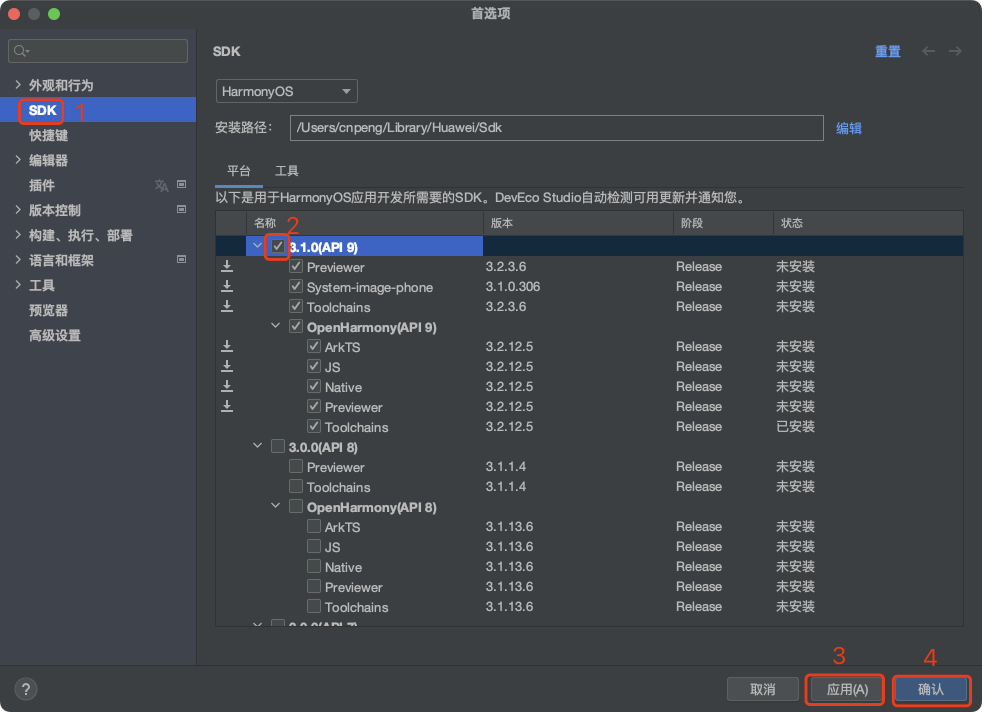

勾选最新版的 SDK (`平台`-`3.1.0（API9）`)，然后点击 `应用`：


点击 `确定`，执行安装操作。但是依旧报错：


点击 `完成` 关闭当前报错弹窗，

然后参考 [《mac下用npm安装包总提示没有权限 permission denied》](https://blog.csdn.net/weixin_43828444/article/details/98661069) 可知，这种错误可能是因为 `.npm` 目录下的部分文件夹被 root 用户所拥有，导致我们没有操作权限。

在终端执行命令 `ls -la /目录名/` 可以查看文件夹的权属情况，然后通过 `sudo chown -R 用户名 /目录名/` 修改权属为普通用户：


完成上述修改后，再次勾选 `3.1.0（Api 9）` 并执行 `应用`，但是又报错了：


好在这次有了解决提示，把提示中的解决方案复制到终端中执行：


然后点击错误弹窗中的 `完成`，再次勾选 `3.1.0（Api 9）` 并执行 `应用`：


点击确定之后，看到如下界面：


至此，问题解决。

##### 1.4.1.2.3. 总结

通过前述解决过程可知，本质还是文件夹权属问题，我们第一次使用命令改变权属时，改的不彻底，如果直接改到 `.npm` 目录，应该也能解决问题了。

另，安装 DevEco Studio 中的报错，应该也可以使用这种方式进行解决。

命令总结：

```bash
# 将某个目录的权属用户改为指定用户。用户名——电脑用户名。
sudo chown -R 用户名 /目录名/

# 修改目录的权属用户为 501:20 对应的用户。
sudo chown -R 501:20 "/Users/cnpeng/.npm"
```

`sudo chown -R 501:20 "/Users/cnpeng/.npm"` 该命令是一个在 Unix 或类 Unix 系统（如 macOS、Linux）上用来**更改文件或目录所有者和组的命令**。它包含以下几个部分：

* `sudo` : 这个命令是用于**以超级用户（root）的身份运行后续的命令**。这样做是为了获得必要的权限来更改文件的所有权，因为普通用户通常没有足够的权限。
* `chown` : 它代表 "`change owner`"，即**更改文件或目录的所有者**。
* `-R`: 这是一个选项，表示**递归地应用更改**。这意味着如果指定的是一个目录，那么该命令会将更改应用到该目录下的所有文件和子目录。
* `501:20` : 这是一个用户ID（UID）和组ID（GID）对，它们分别**对应于系统上的实际用户和组**。在这个例子中，501 是用户ID，20 是组ID。在许多系统中，这些数字标识符对应于具体的用户名和组名，但为了简洁，这里使用了数字形式。
* `"/Users/cnpeng/.npm"`: 这是你要更改所有权的文件或目录路径。在这个例子中，它是 `/Users/cnpeng` 目录下的 `.npm` 隐藏目录。

所以，整个命令的意思是**以超级用户身份递归地将 `/Users/cnpeng/.npm` 目录及其内容的所有者改为 UID 为 501 的用户，并将其所属的组改为 GID 为 20 的组**。这可能是因为某个进程需要这个特定的用户和组才能正常工作，或者是为了实现更严格的权限控制。


#### 1.4.1.3. 界面结构


上图中，

* `.json5` 是一些配置文件，各文件的具体作用可以参考 [《文档-指南-开发基础知识-应用配置文件》](https://developer.harmonyos.com/cn/docs/documentation/doc-guides-V3/app-configuration-file-0000001427584584-V3)。
* `ets` 结尾的文件就是 ArkTs 文件。
* `Entry` 是程序入口。
* 在 Harmony 中 module （模块）被称为 `Ability` ——能力。
* `src/main/ets` 是业务视图和逻辑。
* `src/main/resources` 是资源文件。

对于使用 AndroidStudio 进行开发的 Android 开发者来说，这个操作界面整体和 AndroidStudio 没啥区别。因为 DevEco Studio 和 AndroidStudio 都是基于 JetBrains 开源的 ASM 定制的，如下图：


### 1.4.2. 基础代码分析

`入口组件`：可以作为页面进行跳转的组件，被称为入口组件。

在 `pages/index.ets` 文件中，各处代码的含义如下：


```ts
@Entry
@Component
struct Index {
  @State message: string = 'Hello World'

  build() {
    Row() {
      Column() {
        Text(this.message)
          .fontSize(50)
          .fontWeight(FontWeight.Bold)
          .fontColor('#E35')
            // onClick 方法接收一个 event? 参数，? 表示是可选的。
            // 如果事件中用不到这个 event 对象，可以不在方法的 () 中声明
          .onClick(() => {
            // 点击文本时，改变文本内容。
            this.message = '你好，CnPeng'
          })
      }
      .width('100%')
    }
    .height('100%')
  }
}
```


## 1.5. ArkUI组件-Image

[对应B站视频 P6](https://www.bilibili.com/video/BV1Sa4y1Z7B1/?p=6)

我们要基于 Image 和其他组件实现的效果如下：


### 1.5.1. 显示Image的方式

`PixelMap` 格式，需要自行构建 `PixelMap` 图片对象，略微麻烦。


* 预览时，如果使用了网络图片，即便未申请网络权限，依旧可以预览图片。但部署到真机运行时，必须申请网络权限。

* 设置宽高时，可以仅指定图片的宽度，高度会自动等比例缩放。
    * 如果输入了数值，那么默认单位是：`vp`（可以理解为 Android 中的 `dp`），是一种基于屏幕密度自动计算的单位。如：`width(150)`
    * 如果输入了百分比字符串，则直接按照与屏幕的百分比进行取值。如：`width('100%')`


### 1.5.2. 创建模拟器

创建模拟器、运行模拟器、部署项目到模拟器的基础逻辑和 AndroidStudio 基本一致。


初次运行时，要先安装模拟器资源：


安装完成之后，按照如下步骤进行选择：


创建完成之后，通过下图中的绿色按钮可以运行模拟器：


### 1.5.3. 展示网络图片

#### 1.5.3.1. 声明 Image 组件

在代码中使用 `Image` 组件加载网络图片：

```ts
// entry/src/main/ets/pages/Index.ets

@Entry
@Component
struct Index {
  @State message: string = 'Hello World'

  build() {
    Row() {
      Column() {
        // ... 其他内容省略

        // 加载网络图片
        Image('https://profile-avatar.csdnimg.cn/9f2f1075798c437b8913a219d672128b_north1989.jpg')
          .width(220) // 指定图片宽度为 220 vp，高度会进行自动等比率缩放。
      }
      .width('100%')
    }
    .height('100%')
  }
}
```


#### 1.5.3.2. 申请网络权限

参考 [《文档/指南/开发/安全/访问控制/访问控制授权申请》](https://developer.harmonyos.com/cn/docs/documentation/doc-guides-V3/accesstoken-guidelines-0000001493744016-V3) 申请网络权限（[点击查看可申请的权限](https://developer.harmonyos.com/cn/docs/documentation/doc-guides-V3/permission-list-0000001544464017-V3)）：

```ts
{
  "module": {
    "requestPermissions": [
      // 申请网络权限
      {
        "name": "ohos.permission.INTERNET"
      }
    ],
    // ... 其他内容省略
  }
}
```


申请权限时，完整的标签应该包含如下内容：


通过查看[《应用权限列表》](https://developer.harmonyos.com/cn/docs/documentation/doc-guides-V3/permission-list-0000001544464017-V3) 我们可以知道，`INTERNET` 的授权方式是 `system_grant` ，不是 `user_grant`：


所以，我们在申请权限时，只需要声明权限名称即可。

#### 1.5.3.3. 部署到模拟器


### 1.5.4. 加载本地media图片

加载 `/src/main/resources/base/media` 目录下的图片资源时，格式为：`Image($r(''app.media.文件名))`。


```ts
@Entry
@Component
struct Index {
  @State message: string = 'Hello World'

  build() {
    Row() {
      Column() {
        // ... 其他内容省略

        // 加载本地图片(加载 entry/src/main/resources/base/media 目录下的 icon.png 图片)
        // 格式：Image($r(''app.media.文件名))
        Image($r('app.media.icon'))
          .width(220)
            // 使用插值器后，图片可以让因缩放导致不清晰的图片看起来更清晰
          .interpolation(ImageInterpolation.High)
      }
      .width('100%')
    }
    .height('100%')
  }
}

```


不加 `.interpolation(ImageInterpolation.High)` 时，图片边缘有锯齿。

### 1.5.5. 加载rawfile中的图片

加载 `entry/src/main/resources/rawfile` 目录下的图片资源时，使用的格式为：`Image($rawfile('图片名.后缀名'))`。

我们先在 `entry/src/main/resources/rawfile` 目录下放一张名称为 `icon2.png` 的图片，

```ts
@Entry
@Component
struct Index {
  @State message: string = 'Hello World'

  build() {
    Row() {
      Column() {
        // ... 其他内容省略

        // 加载本地图片(加载 entry/src/main/resources/rawfile 目录下的 icon2.png 图片)
        // 格式：Image($rawfile('图片名.后缀名'))
        Image($rawfile('icon2.png'))
          .width(220)
            // 使用插值器后，图片可以让因缩放导致不清晰的图片看起来更清晰
          .interpolation(ImageInterpolation.High)
      }
      .width('100%')
    }
    .height('100%')
  }
}
```


### 1.5.6. 补充：快速查看API


## 1.6. ArkUI组件-Text

>2023-12-04 周一

[对应 B 站视频 p7](https://www.bilibili.com/video/BV1Sa4y1Z7B1/?p=7)

### 1.6.1. 属性信息


系统会先找 `en_US`、`zh_CN` 这种限定词目录中的资源，如果没有，再从 `base` 目录查找。

### 1.6.2. 示例

先在  `entry/src/main/ets/pages/` 目录下新建 `ImagePage.ets`，其中编写相关代码内容，然后在 `resources` 目录下的 `en_US`、`zh_CN`、`base` 的 `element` 目录中增加字符串资源： 


* `entry/src/main/ets/pages/ImagePage.ets`

```ts
@Entry
@Component
struct Index {
  @State message: string = 'Hello World'

  build() {
    Row() {
      Column() {
        // 加载本地图片(加载 entry/src/main/resources/base/media 目录下的 icon.png 图片)
        // 格式：Image($r(''app.media.文件名))
        Image($r('app.media.icon'))
          .width(220)
            // 使用插值器后，图片可以让因缩放导致不清晰的图片看起来更清晰
          .interpolation(ImageInterpolation.High)

        Text($r('app.string.width_label'))
          .fontSize(20)
          .fontWeight(FontWeight.Bold)
      }
      .width('100%')
    }
    .height('100%')
  }
}
```

* `base/element/string,json`

```json
{
  "string": [
    // ... 其他内容省略
    {
      "name": "width_label",
      "value": "图片宽度："
    }
  ]
}
```

*  `zh_CN/element/string,json`

```json
{
  "string": [
    // ... 其他内容省略
    {
      "name": "width_label",
      "value": "图片宽度："
    }
  ]
}
```

*  `en_US/element/string,json`

```json
{
  "string": [
    // ... 其他内容省略
    {
      "name": "width_label",
      "value": "Image Width:"
    }
  ]
}
```

## 1.7. ArkUI组件-TextInput

> 2023-12-05 周二

[对应视频 P8](https://www.bilibili.com/video/BV1Sa4y1Z7B1?p=8)

### 1.7.1. 属性信息


### 1.7.2. 示例


```ts
@Entry
@Component
struct Index {
  @State imgWidth: number = 30

  build() {
    Row() {
      Column() {
        // 加载本地图片(加载 entry/src/main/resources/base/media 目录下的 icon.png 图片)
        // 格式：Image($r(''app.media.文件名))
        Image($r('app.media.icon'))
          .width(this.imgWidth)
            // 使用插值器后，图片可以让因缩放导致不清晰的图片看起来更清晰
          .interpolation(ImageInterpolation.High)

        Text($r('app.string.width_label'))
          .fontSize(20)
          .fontWeight(FontWeight.Bold)

        // this.imgWidth.toFixed(0)——将 number 转换为 string, 参数表示保留几位小数， 0 表示不保留。
        TextInput({ placeholder: '请输入图片宽度',text:this.imgWidth.toFixed(0)})
          .width(150)
          .backgroundColor('#aec')
          .type(InputType.Number)
          .onChange(width => {
            // console.log("[输入框中内容为]", width)
            // 回调函数中拿到的是字符串，需要使用 Ts 内置的 parseInt 转换为 number
            this.imgWidth = parseInt(width)
          })
      }
      .width('100%')
    }
    .height('100%')
  }
}
```

* `this.imgWidth.toFixed(0)`  中，`toFixed()` 方法用户将 `number` 转换成 `string`，参数表示保留几位小数，0 表示不要小数。
* `parseInt()` 用于将 `string` 转换成 `number`


## 1.8. ArkUI组件-Button

> 2023-12-05 周二

[对应视频 P9](https://www.bilibili.com/video/BV1Sa4y1Z7B1?p=9)

### 1.8.1. 属性信息


### 1.8.2. 示例


```ts
@Entry
@Component
struct Index {
  @State imgWidth: number = 30

  build() {
    Row() {
      Column() {
        // 加载本地图片(加载 entry/src/main/resources/base/media 目录下的 icon.png 图片)
        // 格式：Image($r(''app.media.文件名))
        Image($r('app.media.icon'))
          .width(this.imgWidth)
            // 使用插值器后，图片可以让因缩放导致不清晰的图片看起来更清晰
          .interpolation(ImageInterpolation.High)

        Text($r('app.string.width_label'))
          .fontSize(20)
          .fontWeight(FontWeight.Bold)

        // this.imgWidth.toFixed(0)——将 number 转换为 string, 参数表示保留几位小数， 0 表示不保留。
        TextInput({ placeholder: '请输入图片宽度', text: this.imgWidth.toFixed(0) })
          .width(150)
          .backgroundColor('#aec')
          .type(InputType.Number)
          .onChange(width => {
            // console.log("[输入框中内容为]", width)
            // 回调函数中拿到的是字符串，需要使用 Ts 内置的 parseInt 转换为 number
            this.imgWidth = parseInt(width)
          })

        Button("点击缩小")
          .width(130)
          .fontSize(20)
          .margin(10)  // 外部间距
          .onClick(() => {
            if (this.imgWidth >= 10) {
              this.imgWidth -= 10
            }
          })
        Button("点击放大")
          .width(130)
          .fontSize(20)
          .onClick(() => {
            if (this.imgWidth < 300) {
              this.imgWidth += 10
            }
          })
      }
      .width('100%')
    }
    .height('100%')
  }
}
```

## 1.9. ArkUI组件-Slider

> 2023-12-05 周二

[对应视频 P10](https://www.bilibili.com/video/BV1Sa4y1Z7B1?p=10)

### 1.9.1. 属性信息


* `step` 滑动的步长，默认为 1.
* `style:SliderStyle.OutSet`，滑块的样式，`OutSet` 表示滑块超出滑动条；`InSet` 表示滑块在滑动条内部。
* `direction:Axis.Vertical`，滑动条的方向，`Vertical` 表示垂直方向，垂直时，默认最小值在上方，最大值在下方。
* `reverse:false`，是否反向滑动。
    * 默认情况下，水平的滑动条左侧最小，右侧最大；垂直滑动条上方最下，下方最大。
    * 若启用反向滑动，则水平滑动条的左侧最大，右侧最小；垂直滑动条的上方最大，下方最小。

### 1.9.2. 示例


```ts
@Entry
@Component
struct Index {
  @State imgWidth: number = 30

  build() {
    Row() {
      Column() {
        // 加载本地图片(加载 entry/src/main/resources/base/media 目录下的 icon.png 图片)
        // 格式：Image($r(''app.media.文件名))
        Image($r('app.media.icon'))
          .width(this.imgWidth)
            // 使用插值器后，图片可以让因缩放导致不清晰的图片看起来更清晰
          .interpolation(ImageInterpolation.High)

        Text($r('app.string.width_label'))
          .fontSize(20)
          .fontWeight(FontWeight.Bold)

        // this.imgWidth.toFixed(0)——将 number 转换为 string, 参数表示保留几位小数， 0 表示不保留。
        TextInput({ placeholder: '请输入图片宽度', text: this.imgWidth.toFixed(0) })
          .width(150)
          .backgroundColor('#aec')
          .type(InputType.Number)
          .onChange(width => {
            // console.log("[输入框中内容为]", width)
            // 回调函数中拿到的是字符串，需要使用 Ts 内置的 parseInt 转换为 number
            this.imgWidth = parseInt(width)
          })

        Button("点击缩小")
          .width(130)
          .fontSize(20)
          .margin(10) // 外部间距
          .onClick(() => {
            if (this.imgWidth >= 10) {
              this.imgWidth -= 10
            }
          })
        Button("点击放大")
          .width(130)
          .fontSize(20)
          .onClick(() => {
            if (this.imgWidth < 300) {
              this.imgWidth += 10
            }
          })

        Slider({
          min: 10,  // 最小值
          max: 300, // 最大值
          value: this.imgWidth, // 初始值，当前值
          step: 10,  // 步长，每次滑动的前进数量
          style: SliderStyle.InSet // 滑块样式：在滑动条内部
        })
          .width('90%')
          .blockColor('#fff')  // 滑块颜色
          .trackThickness(25)  // 滑动条的高度（厚度）
          .showTips(true)  // 滑动时以气泡展示当前百分比
          .onChange(num => {  // 滑动的事件监听
            this.imgWidth = num
          })

      }
      .width('100%')
    }
    .height('100%')
  }
}
```


## 1.10. ArkUI组件-Column和Row

>2023-11-06 周三

[视频地址-P11](https://www.bilibili.com/video/BV1Sa4y1Z7B1?p=11)

本节主要介绍：线性布局组件（`column` 控制垂直方向的列布局，`row` 控制水平方向的行布局）和常见布局属性。

### 1.10.1. 容器、主轴、交叉轴


### 1.10.2. 对齐方式

#### 1.10.2.1. 对齐方式


  

#### 1.10.2.2. justifyContent的取值及效果

默认取值为 `FlexAlign.Start`


#### 1.10.2.3. alignItems取值及其效果

默认取值为 `HorizontalAlign.Center`


### 1.10.3. 示例

* `entry/src/main/ets/pages/ImageOage.ets`

```ts
@Entry
@Component
struct Index {
  @State imgWidth: number = 30

  build() {

    // Column({space:15}) { // 通过 space 指定主轴方向上元素的间距
    Column() { // 通过 space 指定主轴方向上元素的间距
      // 增加 row 作为 img 父容器，解决改变图片大小时其他元素内容位置会跟随变化的问题。
      Row() {
        Image($r('app.media.icon'))
          .width(this.imgWidth)
          .interpolation(ImageInterpolation.High)
      }
      .width('100%') // row 的宽度
      .height(400) // row 的高度
      .justifyContent(FlexAlign.Center) // 主轴上的对齐方式。row 的主轴为 x 轴。

      // 增加row作为Text和TextInput的父容器
      Row() {
        Text($r('app.string.width_label'))
          .fontSize(20)
          .fontWeight(FontWeight.Bold)

        // this.imgWidth.toFixed(0)——将 number 转换为 string, 参数表示保留几位小数， 0 表示不保留。
        TextInput({ placeholder: '请输入图片宽度', text: this.imgWidth.toFixed(0) })
          .width(150)
          .backgroundColor('#aec')
          .type(InputType.Number)
          .onChange(width => {
            // console.log("[输入框中内容为]", width)
            // 回调函数中拿到的是字符串，需要使用 Ts 内置的 parseInt 转换为 number
            this.imgWidth = parseInt(width)
          })
      }.width('100%')
      .justifyContent(FlexAlign.SpaceBetween) // 主轴上的对齐方式。row 的主轴为 x 轴。
      // .padding(10) //一次性设置 上下左右 的 padding 均为 10
      .padding({top:3 ,bottom:3,left:15,right:15}) // 分别指定上下左右的 padding（内间距）

      // 增加一条分割线
      Divider()
        .margin({left:15,right:15}) // 指定与父容器或同级元素的间距（外间距）

      Row() {
        Button("点击缩小")
          .width(130)
          .fontSize(20)
          .onClick(() => {
            if (this.imgWidth >= 10) {
              this.imgWidth -= 10
            }
          })
        Button("点击放大")
          .width(130)
          .fontSize(20)
          .onClick(() => {
            if (this.imgWidth < 300) {
              this.imgWidth += 10
            }
          })
      }.width('100%')
      .height(45)
      .justifyContent(FlexAlign.SpaceEvenly)
      .margin({top:15})

      Slider({
        min: 10, // 最小值
        max: 300, // 最大值
        value: this.imgWidth, // 初始值，当前值
        step: 10, // 步长，每次滑动的前进数量
        style: SliderStyle.InSet // 滑块样式：在滑动条内部
      })
        .width('90%')
        .margin(15)
        .blockColor('#fff') // 滑块颜色
        .trackThickness(25) // 滑动条的高度（厚度）
        .showTips(true) // 滑动时以气泡展示当前百分比
        .onChange(num => { // 滑动的事件监听
          this.imgWidth = num
        })

    }
    .width('100%')
    .height('100%')
  }
}
```

在上述代码中，我们通过 Row 和 Column 将元素（组件）分组摆放，并通过 `justifyContent`（主轴上元素对齐方式）、`margin`(元素外边距)、`padding`(元素内边距) 让界面看起来更优雅。

上述代码在预览界面的效果如下：


### 1.10.4. 总结


## 1.11. ArkUI组件-循环渲染和条件渲染控制

 >2023-11-06 周三

[视频地址-P12](https://www.bilibili.com/video/BV1Sa4y1Z7B1?p=12)

主要包含：`ForEach` 和 `if-else`。

### 1.11.1. ForEach 循环渲染

期望实现的效果:


#### 1.11.1.1. 基础语法


#### 1.11.1.2. 示例

* `entry/src/main/ets/pages/ItemPage.ets`

```ts
// 定义一个条目类
class Item {
  name: string
  image: ResourceStr
  price: number

  constructor(name: string, image: ResourceStr, price: number) {
    this.name = name
    this.image = image
    this.price = price
  }
}

@Entry
@Component
struct ItemPage {
  // 声明条目数组
  private items: Array<Item> = [
    new Item('华为', $r('app.media.icon'), 6999),
    new Item('小米', $r('app.media.icon'), 5888),
    new Item('Vivo', $r('app.media.icon'), 4777),
    new Item('Oppo', $r('app.media.icon'), 3666),
    new Item('Realme', $r('app.media.icon'), 2555),
  ]

  build() {
    Column({ space: 8 }) {
      // 顶部标题栏
      Row() {
        Text('商品列表')
          .fontSize(24)
          .fontWeight(FontWeight.Bold)
      }
      .width('100%')
      .margin(15)

      // 列表数据
      Column({ space: 10 }) {
        // 循环渲染
        ForEach(
          this.items,
          // 注意此处 item 明确指定了类型为 Item, 所以书写时可以直接提示对应的属性
          // 如果使用默认的 any, 书写时不会有属性提示。
          (item: Item, index?: number) => {
            Row({space:10}) {
              Image(item.image)
                .width(100)
              Column({space:4}) {
                Text(item.name)
                  .fontWeight(FontWeight.Bold)
                  .fontSize(20) 
                // Text(item.price.toFixed(2)) // 数值直接转字符串
                Text('￥'+item.price) // string + number = string
                  .fontSize(18)
                  .fontColor('#F36')
              }
              .height('100%')
              .alignItems(HorizontalAlign.Start)
            }
            .width('100%')
            .height(120)
            .padding(10) // 内边距 10 。也可以使用 {left:,top:,right:,bottom:}
            .backgroundColor("#FFF")  // 背景色
            .borderRadius(10) // 圆角
          }
        )
      }
    }
    .width('100%')
    .height('100%')
    .backgroundColor('#EFEFEF')
    .padding(15)
  }
}
```

预览效果：


### 1.11.2. If-else 条件渲染

#### 1.11.2.1. 基础语法


#### 1.11.2.2. 示例


```ts
// 定义一个条目类
class Item {
  name: string
  image: ResourceStr
  price: number
  discount: number

  // discount 可选
  // constructor(name: string, image: ResourceStr, price: number, discount?: number) {
  // discount 默认为 0 。
  constructor(name: string, image: ResourceStr, price: number, discount: number = 0) {
    this.name = name
    this.image = image
    this.price = price
    this.discount = discount
  }
}

@Entry
@Component
struct ItemPage {
  // 声明条目数组
  private items: Array<Item> = [
    new Item('华为', $r('app.media.icon'), 6999, 1200),
    new Item('小米', $r('app.media.icon'), 5888),
    new Item('Vivo', $r('app.media.icon'), 4777),
    new Item('Oppo', $r('app.media.icon'), 3666),
    new Item('Realme', $r('app.media.icon'), 2555),
  ]

  build() {
    Column({ space: 8 }) {
      // 顶部标题栏
      Row() {
        Text('商品列表')
          .fontSize(24)
          .fontWeight(FontWeight.Bold)
      }
      .width('100%')
      .margin(15)

      // 列表数据
      Column({ space: 10 }) {
        // 循环渲染
        ForEach(
          this.items,
          // 注意此处 item 明确指定了类型为 Item, 所以书写时可以直接提示对应的属性
          // 如果使用默认的 any, 书写时不会有属性提示。
          (item: Item, index?: number) => {
            Row({ space: 10 }) {
              Image(item.image)
                .width(100)
              Column({ space: 4 }) {
                Text(item.name)
                  .fontWeight(FontWeight.Bold)
                  .fontSize(20)

                if (item.discount) {
                  // 原价
                  Text('原价 ￥' + item.price) // string + number = string
                    .fontSize(18)
                    .fontColor('#CCC')
                    .decoration({ // 删除线及其颜色。
                      type: TextDecorationType.LineThrough,
                      color: '#F00' })
                  // 折扣价
                  Text('折扣价 ￥' + (item.price - item.discount)) // string + number = string
                    .fontSize(18)
                    .fontColor('#F36')
                  // 补贴
                  Text('补贴 ￥' + item.discount) // string + number = string
                    .fontSize(18)
                    .fontColor('#F36')
                } else {
                  // Text(item.price.toFixed(2)) // 数值直接转字符串
                  Text('￥' + item.price) // string + number = string
                    .fontSize(18)
                    .fontColor('#F36')
                }
              }
              .height('100%')
              .alignItems(HorizontalAlign.Start)
            }
            .width('100%')
            .height(120)
            .padding(10) // 内边距 10 。也可以使用 {left:,top:,right:,bottom:}
            .backgroundColor("#FFF") // 背景色
            .borderRadius(10) // 圆角
          }
        )
      }
    }
    .width('100%')
    .height('100%')
    .backgroundColor('#EFEFEF')
    .padding(15)
  }
}
```

## 1.12. ArkUI组件-List

 >2023-11-06 周三

[视频地址-P13](https://www.bilibili.com/video/BV1Sa4y1Z7B1?p=13)

前一节使用 `Column`+`ForEach` 渲染了一个商品列表，但是，当商品比较多，条目超出屏幕高度时，列表无法滚动，也就是说，列表外的内容我们将无法查看。

而使用 `List`，则解决了该问题——它既能渲染列表，也能滚动展示屏幕外的内容。

### 1.12.1. 基础语法


### 1.12.2. 示例


```ts
// 定义一个条目类
class Item {
  name: string
  image: ResourceStr
  price: number
  discount: number

  // discount 可选
  // constructor(name: string, image: ResourceStr, price: number, discount?: number) {
  // discount 默认为 0 。
  constructor(name: string, image: ResourceStr, price: number, discount: number = 0) {
    this.name = name
    this.image = image
    this.price = price
    this.discount = discount
  }
}

@Entry
@Component
struct ItemPage {
  // 声明条目数组
  private items: Array<Item> = [
    new Item('华为', $r('app.media.icon'), 6999, 1200),
    new Item('小米', $r('app.media.icon'), 5888),
    new Item('Vivo', $r('app.media.icon'), 4777),
    new Item('Oppo', $r('app.media.icon'), 3666),
    new Item('Realme', $r('app.media.icon'), 2555),
    new Item('OnePlus', $r('app.media.icon'), 1444),
    new Item('iPhoone', $r('app.media.icon'), 999),
  ]

  build() {
    Column({ space: 8 }) {
      // 顶部标题栏
      Row() {
        Text('商品列表')
          .fontSize(24)
          .fontWeight(FontWeight.Bold)
      }
      .width('100%')
      .margin(15)

      // 列表数据
      List({ space: 10 }) {
        // 循环渲染
        ForEach(
          this.items,
          // 注意此处 item 明确指定了类型为 Item, 所以书写时可以直接提示对应的属性
          // 如果使用默认的 any, 书写时不会有属性提示。
          (item: Item, index?: number) => {
            ListItem(){
              Row({ space: 10 }) {
                Image(item.image)
                  .width(100)
                Column({ space: 4 }) {
                  Text(item.name)
                    .fontWeight(FontWeight.Bold)
                    .fontSize(20)

                  if (item.discount) {
                    // 原价
                    Text('原价 ￥' + item.price) // string + number = string
                      .fontSize(18)
                      .fontColor('#CCC')
                      .decoration({ // 删除线及其颜色。
                        type: TextDecorationType.LineThrough,
                        color: '#F00' })
                    // 折扣价
                    Text('折扣价 ￥' + (item.price - item.discount)) // string + number = string
                      .fontSize(18)
                      .fontColor('#F36')
                    // 补贴
                    Text('补贴 ￥' + item.discount) // string + number = string
                      .fontSize(18)
                      .fontColor('#F36')
                  } else {
                    // Text(item.price.toFixed(2)) // 数值直接转字符串
                    Text('￥' + item.price) // string + number = string
                      .fontSize(18)
                      .fontColor('#F36')
                  }
                }
                .height('100%')
                .alignItems(HorizontalAlign.Start)
              }
              .width('100%')
              .height(120)
              .padding(10) // 内边距 10 。也可以使用 {left:,top:,right:,bottom:}
              .backgroundColor("#FFF") // 背景色
              .borderRadius(10) // 圆角
            }
          }
        )
      }
      .width('100%')
      // .height('100%') // 如果仅指定 100%，最后一条展示不全——丢失的部分恰好是标题的高度。
      .layoutWeight(1) // 布局权重，默认为 0 。指定该值以后，除了顶部标题以外，其余高度都被 List 占据。
      .listDirection(Axis.Vertical) // 列表方向
    }
    .width('100%')
    .height('100%')
    .backgroundColor('#EFEFEF')
    .padding(15)
  }
}
```

注意📢 ：

* 列表中的条目必须用 `ListItem` 包裹。
* `ListItem` 内仅能包含一个根组件。
* `layoutWeight(1)` 用于指定布局权重，不指定时默认为 0 ，指定具体数值后，对应的组件会占据父组件剩余的高度。


## 1.13. ArkUI组件-自定义组件

 >2023-11-06 周三

[视频地址-P14](https://www.bilibili.com/video/BV1Sa4y1Z7B1?p=14)

主要包括：创建自定义组件、`@Builder`(自定义构建函数)、`@Styles`（自定义公共样式）。

基于前面章节的内容，本节要将前面的标题栏和列表抽取成自定义组件。

### 1.13.1. 自定义组件

#### 1.13.1.1. 基本语法

自定义组件的基本结构：

```ts
@Component
struct 组件名{
    build(){
       // 组件具体内容。
    }
}
```

被 `@Component` 修饰的都是自定义组件，被 `@Entry` 修饰的表示是页面。


> 注意：上图中声明自定义组件时没有使用 `export`、使用组件时也没有声明 `import`。这就说明，自定义的 `Header` 组件和 `ItemPage` 组件在同一个 `ets` 文件中。同理，`OrderPage` 组件所在的 `ets` 文件中也有一个自定义的 `Header` 组件。

#### 1.13.1.2. 示例

自定义组件可以和 `@Entry` 修饰的页面组件放在同一个 `ets` 文件中——只在当前文件有效，也可以定义在单独的 `ets` 文件中——全局都可以引用。

在单独的文件中定义自定义组件时，需要使用 `export` 进行导出，使用时需要通过 `import` 进行导入。


* `entry/src/main/ets/components/CpHeader.ets`

```ts
@Component  // 组件标识
export struct CpHeader { // 只有通过 export 导出的组件才能被其他组件使用
  private title: ResourceStr // 声明属性

  build() {
    Row() {
      Image($r('app.media.ic_public_back'))
        .width(30)
      Text(this.title) // 使用属性
        .fontSize(24)
        .fontWeight(FontWeight.Bold)

      // 用于占据剩余空间
      Blank()
      Image($r('app.media.ic_public_refresh'))
        .width(30)
    }
    .width('100%')
  }
}
```

* `Blank()` 组件可以用户填充剩余的空间。

### 1.13.2. `@Builder` 构建函数

分为两种：

#### 1.13.2.1. 全局构建函数

`全局的自定义构建函数` 在当前组件外部定义，格式如下：

```ts
@Builder function 函数名(参数名:参数类型){
    // 定义组件内容 
}
```


```ts
// 定义一个条目类
class Item {
  name: string
  image: ResourceStr
  price: number
  discount: number

  // discount 可选
  // constructor(name: string, image: ResourceStr, price: number, discount?: number) {
  // discount 默认为 0 。
  constructor(name: string, image: ResourceStr, price: number, discount: number = 0) {
    this.name = name
    this.image = image
    this.price = price
    this.discount = discount
  }
}

// 导入自定义组件
import { CpHeader } from '../components/CpHeader'

// 使用构建函数构建组件
// 使用 @Builder 修饰，定义在组件外部，被称为【全局构建函数】
@Builder function ItemCard(item: Item) {
  Row({ space: 10 }) {
    Image(item.image)
      .width(100)
    Column({ space: 4 }) {
      Text(item.name)
        .fontWeight(FontWeight.Bold)
        .fontSize(20)

      if (item.discount) {
        // 原价
        Text('原价 ￥' + item.price) // string + number = string
          .fontSize(18)
          .fontColor('#CCC')
          .decoration({ // 删除线及其颜色。
            type: TextDecorationType.LineThrough,
            color: '#F00' })
        // 折扣价
        Text('折扣价 ￥' + (item.price - item.discount)) // string + number = string
          .fontSize(18)
          .fontColor('#F36')
        // 补贴
        Text('补贴 ￥' + item.discount) // string + number = string
          .fontSize(18)
          .fontColor('#F36')
      } else {
        // Text(item.price.toFixed(2)) // 数值直接转字符串
        Text('￥' + item.price) // string + number = string
          .fontSize(18)
          .fontColor('#F36')
      }
    }
    .height('100%')
    .alignItems(HorizontalAlign.Start)
  }
  .width('100%')
  .height(120)
  .padding(10) // 内边距 10 。也可以使用 {left:,top:,right:,bottom:}
  .backgroundColor("#FFF") // 背景色
  .borderRadius(10) // 圆角
}

@Entry
@Component
struct ItemPage {
  // 声明条目数组
  private items: Array<Item> = [
    new Item('华为', $r('app.media.icon'), 6999, 1200),
    new Item('小米', $r('app.media.icon'), 5888),
    new Item('Vivo', $r('app.media.icon'), 4777),
    new Item('Oppo', $r('app.media.icon'), 3666),
    new Item('Realme', $r('app.media.icon'), 2555),
    new Item('OnePlus', $r('app.media.icon'), 1444),
    new Item('iPhoone', $r('app.media.icon'), 999),
  ]

  build() {
    Column({ space: 8 }) {
      // 顶部标题栏--使用自定义组件。
      CpHeader({ title: '商品列表' })
        .margin({ bottom: 15 })

      // 列表数据
      List({ space: 10 }) {
        // 循环渲染
        ForEach(
          this.items,
          // 注意此处 item 明确指定了类型为 Item, 所以书写时可以直接提示对应的属性
          // 如果使用默认的 any, 书写时不会有属性提示。
          (item: Item, index?: number) => {
            ListItem() {
              // 使用构建函数
              ItemCard(item)
            }
          }
        )
      }
      .width('100%')
      // .height('100%') // 如果仅指定 100%，最后一条展示不全——丢失的部分恰好是标题的高度。
      .layoutWeight(1) // 布局权重，默认为 0 。指定该值以后，除了顶部标题以外，其余高度都被 List 占据。
      .listDirection(Axis.Vertical) // 列表方向
    }
    .width('100%')
    .height('100%')
    .backgroundColor('#EFEFEF')
    .padding(15)
  }
}
```

#### 1.13.2.2. 局部自定义构建函数

定义在当前组件内部，不需要添加 `function` 关键字。组件内使用时，需要通过 `this.` 进行调用。


```ts
// 定义一个条目类
class Item {
  name: string
  image: ResourceStr
  price: number
  discount: number

  // discount 可选
  // constructor(name: string, image: ResourceStr, price: number, discount?: number) {
  // discount 默认为 0 。
  constructor(name: string, image: ResourceStr, price: number, discount: number = 0) {
    this.name = name
    this.image = image
    this.price = price
    this.discount = discount
  }
}

// 导入自定义组件
import { CpHeader } from '../components/CpHeader'

@Entry
@Component
struct ItemPage {
  // 声明条目数组
  private items: Array<Item> = [
    new Item('华为', $r('app.media.icon'), 6999, 1200),
    new Item('小米', $r('app.media.icon'), 5888),
    new Item('Vivo', $r('app.media.icon'), 4777),
    new Item('Oppo', $r('app.media.icon'), 3666),
    new Item('Realme', $r('app.media.icon'), 2555),
    new Item('OnePlus', $r('app.media.icon'), 1444),
    new Item('iPhoone', $r('app.media.icon'), 999),
  ]

  // 使用构建函数构建组件
  // 使用 @Builder 修饰，定义在组件内部，被称为【局部构建函数】
  @Builder ItemCard(item: Item) {
    Row({ space: 10 }) {
      Image(item.image)
        .width(100)
      Column({ space: 4 }) {
        Text(item.name)
          .fontWeight(FontWeight.Bold)
          .fontSize(20)

        if (item.discount) {
          // 原价
          Text('原价 ￥' + item.price) // string + number = string
            .fontSize(18)
            .fontColor('#CCC')
            .decoration({ // 删除线及其颜色。
              type: TextDecorationType.LineThrough,
              color: '#F00' })
          // 折扣价
          Text('折扣价 ￥' + (item.price - item.discount)) // string + number = string
            .fontSize(18)
            .fontColor('#F36')
          // 补贴
          Text('补贴 ￥' + item.discount) // string + number = string
            .fontSize(18)
            .fontColor('#F36')
        } else {
          // Text(item.price.toFixed(2)) // 数值直接转字符串
          Text('￥' + item.price) // string + number = string
            .fontSize(18)
            .fontColor('#F36')
        }
      }
      .height('100%')
      .alignItems(HorizontalAlign.Start)
    }
    .width('100%')
    .height(120)
    .padding(10) // 内边距 10 。也可以使用 {left:,top:,right:,bottom:}
    .backgroundColor("#FFF") // 背景色
    .borderRadius(10) // 圆角
  }

  build() {
    Column({ space: 8 }) {
      // 顶部标题栏--使用自定义组件。
      CpHeader({ title: '商品列表' })
        .margin({ bottom: 15 })

      // 列表数据
      List({ space: 10 }) {
        // 循环渲染
        ForEach(
          this.items,
          // 注意此处 item 明确指定了类型为 Item, 所以书写时可以直接提示对应的属性
          // 如果使用默认的 any, 书写时不会有属性提示。
          (item: Item, index?: number) => {
            ListItem() {
              // 使用局部构建函数时要通过 this. 进行调用
              this.ItemCard(item)
            }
          }
        )
      }
      .width('100%')
      // .height('100%') // 如果仅指定 100%，最后一条展示不全——丢失的部分恰好是标题的高度。
      .layoutWeight(1) // 布局权重，默认为 0 。指定该值以后，除了顶部标题以外，其余高度都被 List 占据。
      .listDirection(Axis.Vertical) // 列表方向
    }
    .width('100%')
    .height('100%')
    .backgroundColor('#EFEFEF')
    .padding(15)
  }
}
```

### 1.13.3. `@Styles`（公共样式）

将重复出现的样式内容抽取为公共样式，抽取时使用 `@Styles` 进行修饰。

#### 1.13.3.1. 全局公共样式函数

定义在组件外部，格式如下：

```ts
@Styles function 函数名(){
  // 定义样式时不需要组件对象，直接 . 即可。
  .width('100%')
}
```


```ts
// 定义一个条目类
class Item {
  name: string
  image: ResourceStr
  price: number
  discount: number

  // discount 可选
  // constructor(name: string, image: ResourceStr, price: number, discount?: number) {
  // discount 默认为 0 。
  constructor(name: string, image: ResourceStr, price: number, discount: number = 0) {
    this.name = name
    this.image = image
    this.price = price
    this.discount = discount
  }
}

// 导入自定义组件
import { CpHeader } from '../components/CpHeader'

@Styles function fillScreenStyle(){
  .width('100%')
  .height('100%')
  .backgroundColor('#EFEFEF')
  .padding(15)
}

@Entry
@Component
struct ItemPage {
  // 声明条目数组
  private items: Array<Item> = [
    new Item('华为', $r('app.media.icon'), 6999, 1200),
    new Item('小米', $r('app.media.icon'), 5888),
    new Item('Vivo', $r('app.media.icon'), 4777),
    new Item('Oppo', $r('app.media.icon'), 3666),
    new Item('Realme', $r('app.media.icon'), 2555),
    new Item('OnePlus', $r('app.media.icon'), 1444),
    new Item('iPhoone', $r('app.media.icon'), 999),
  ]

  // 使用构建函数构建组件
  // 使用 @Builder 修饰，定义在组件内部，被称为【局部构建函数】
  @Builder ItemCard(item: Item) {
    Row({ space: 10 }) {
      Image(item.image)
        .width(100)
      Column({ space: 4 }) {
        Text(item.name)
          .fontWeight(FontWeight.Bold)
          .fontSize(20)

        if (item.discount) {
          // 原价
          Text('原价 ￥' + item.price) // string + number = string
            .fontSize(18)
            .fontColor('#CCC')
            .decoration({ // 删除线及其颜色。
              type: TextDecorationType.LineThrough,
              color: '#F00' })
          // 折扣价
          Text('折扣价 ￥' + (item.price - item.discount)) // string + number = string
            .fontSize(18)
            .fontColor('#F36')
          // 补贴
          Text('补贴 ￥' + item.discount) // string + number = string
            .fontSize(18)
            .fontColor('#F36')
        } else {
          // Text(item.price.toFixed(2)) // 数值直接转字符串
          Text('￥' + item.price) // string + number = string
            .fontSize(18)
            .fontColor('#F36')
        }
      }
      .height('100%')
      .alignItems(HorizontalAlign.Start)
    }
    .width('100%')
    .height(120)
    .padding(10) // 内边距 10 。也可以使用 {left:,top:,right:,bottom:}
    .backgroundColor("#FFF") // 背景色
    .borderRadius(10) // 圆角
  }

  build() {
    Column({ space: 8 }) {
      // 顶部标题栏--使用自定义组件。
      CpHeader({ title: '商品列表' })
        .margin({ bottom: 15 })

      // 列表数据
      List({ space: 10 }) {
        // 循环渲染
        ForEach(
          this.items,
          // 注意此处 item 明确指定了类型为 Item, 所以书写时可以直接提示对应的属性
          // 如果使用默认的 any, 书写时不会有属性提示。
          (item: Item, index?: number) => {
            ListItem() {
              // 使用局部构建函数时要通过 this. 进行调用
              this.ItemCard(item)
            }
          }
        )
      }
      .width('100%')
      // .height('100%') // 如果仅指定 100%，最后一条展示不全——丢失的部分恰好是标题的高度。
      .layoutWeight(1) // 布局权重，默认为 0 。指定该值以后，除了顶部标题以外，其余高度都被 List 占据。
      .listDirection(Axis.Vertical) // 列表方向
    }
    .fillScreenStyle()
  }
}
```

#### 1.13.3.2. 局部公共样式 

定义在组件内部，仅供当前组件使用，不需要 `function` 关键字，格式如下：

```ts
@Styles 函数名(){
  // 定义样式时不需要组件对象，直接 . 即可。
  .width('100%')
}
```


```ts
// 定义一个条目类
class Item {
  name: string
  image: ResourceStr
  price: number
  discount: number

  // discount 可选
  // constructor(name: string, image: ResourceStr, price: number, discount?: number) {
  // discount 默认为 0 。
  constructor(name: string, image: ResourceStr, price: number, discount: number = 0) {
    this.name = name
    this.image = image
    this.price = price
    this.discount = discount
  }
}

// 导入自定义组件
import { CpHeader } from '../components/CpHeader'


@Entry
@Component
struct ItemPage {
  // 声明条目数组
  private items: Array<Item> = [
    new Item('华为', $r('app.media.icon'), 6999, 1200),
    new Item('小米', $r('app.media.icon'), 5888),
    new Item('Vivo', $r('app.media.icon'), 4777),
    new Item('Oppo', $r('app.media.icon'), 3666),
    new Item('Realme', $r('app.media.icon'), 2555),
    new Item('OnePlus', $r('app.media.icon'), 1444),
    new Item('iPhoone', $r('app.media.icon'), 999),
  ]

  // 使用构建函数构建组件
  // 使用 @Builder 修饰，定义在组件内部，被称为【局部构建函数】
  @Builder ItemCard(item: Item) {
    Row({ space: 10 }) {
      Image(item.image)
        .width(100)
      Column({ space: 4 }) {
        Text(item.name)
          .fontWeight(FontWeight.Bold)
          .fontSize(20)

        if (item.discount) {
          // 原价
          Text('原价 ￥' + item.price) // string + number = string
            .fontSize(18)
            .fontColor('#CCC')
            .decoration({ // 删除线及其颜色。
              type: TextDecorationType.LineThrough,
              color: '#F00' })
          // 折扣价
          Text('折扣价 ￥' + (item.price - item.discount)) // string + number = string
            .fontSize(18)
            .fontColor('#F36')
          // 补贴
          Text('补贴 ￥' + item.discount) // string + number = string
            .fontSize(18)
            .fontColor('#F36')
        } else {
          // Text(item.price.toFixed(2)) // 数值直接转字符串
          Text('￥' + item.price) // string + number = string
            .fontSize(18)
            .fontColor('#F36')
        }
      }
      .height('100%')
      .alignItems(HorizontalAlign.Start)
    }
    .width('100%')
    .height(120)
    .padding(10) // 内边距 10 。也可以使用 {left:,top:,right:,bottom:}
    .backgroundColor("#FFF") // 背景色
    .borderRadius(10) // 圆角
  }

  // 局部样式，不需要 function 关键字
  @Styles fillScreenStyle(){
    .width('100%')
    .height('100%')
    .backgroundColor('#EFEFEF')
    .padding(15)
  }

  build() {
    Column({ space: 8 }) {
      // 顶部标题栏--使用自定义组件。
      CpHeader({ title: '商品列表' })
        .margin({ bottom: 15 })

      // 列表数据
      List({ space: 10 }) {
        // 循环渲染
        ForEach(
          this.items,
          // 注意此处 item 明确指定了类型为 Item, 所以书写时可以直接提示对应的属性
          // 如果使用默认的 any, 书写时不会有属性提示。
          (item: Item, index?: number) => {
            ListItem() {
              // 使用局部构建函数时要通过 this. 进行调用
              this.ItemCard(item)
            }
          }
        )
      }
      .width('100%')
      // .height('100%') // 如果仅指定 100%，最后一条展示不全——丢失的部分恰好是标题的高度。
      .layoutWeight(1) // 布局权重，默认为 0 。指定该值以后，除了顶部标题以外，其余高度都被 List 占据。
      .listDirection(Axis.Vertical) // 列表方向
    }
    .fillScreenStyle()
  }
}
```

#### 1.13.3.3. 注意事项

使用 `@Styles` 抽取样式时，仅能抽取通用属性，也就是所有组件都拥有的属性，如 width、height、backgroundColor 等。


### 1.13.4. `@Extend(组件名)` 抽取组件专有样式

在前一小节中，我们已经提到过 `@Styles` 抽取样式时，仅能抽取通用属性，也就是所有组件都拥有的属性，如 width、height、backgroundColor 等。

如： `Text` 组件特有的 `fontSize()`、`fontColor()` 样式属性，我们可以使用 `@Extend(Text)` 继承模式来抽取。

需要注意：📢

* **`@Extend` 只能写在组件外，做全局使用。**
* `@Extend` 内还可以写事件方法。


```ts
// 定义一个条目类
class Item {
  name: string
  image: ResourceStr
  price: number
  discount: number

  // discount 可选
  // constructor(name: string, image: ResourceStr, price: number, discount?: number) {
  // discount 默认为 0 。
  constructor(name: string, image: ResourceStr, price: number, discount: number = 0) {
    this.name = name
    this.image = image
    this.price = price
    this.discount = discount
  }
}

// 导入自定义组件
import { CpHeader } from '../components/CpHeader'

// 使用 @Extend-继承模式 抽取组件特有的样式属性。
// @Extend(组件名) 只能定义在组件外部。
@Extend(Text)function priceTextStyle(){
  .fontSize(18)
  .fontColor('#F36')
}

@Entry
@Component
struct ItemPage {
  // 声明条目数组
  private items: Array<Item> = [
    new Item('华为', $r('app.media.icon'), 6999, 1200),
    new Item('小米', $r('app.media.icon'), 5888),
    new Item('Vivo', $r('app.media.icon'), 4777),
    new Item('Oppo', $r('app.media.icon'), 3666),
    new Item('Realme', $r('app.media.icon'), 2555),
    new Item('OnePlus', $r('app.media.icon'), 1444),
    new Item('iPhoone', $r('app.media.icon'), 999),
  ]

  // 使用构建函数构建组件
  // 使用 @Builder 修饰，定义在组件内部，被称为【局部构建函数】
  @Builder ItemCard(item: Item) {
    Row({ space: 10 }) {
      Image(item.image)
        .width(100)
      Column({ space: 4 }) {
        Text(item.name)
          .fontWeight(FontWeight.Bold)
          .fontSize(20)
        if (item.discount) {
          // 原价
          Text('原价 ￥' + item.price) // string + number = string
            .fontSize(18)
            .fontColor('#CCC')
            .decoration({ // 删除线及其颜色。
              type: TextDecorationType.LineThrough,
              color: '#F00' })
          // 折扣价
          Text('折扣价 ￥' + (item.price - item.discount)) // string + number = string
            .priceTextStyle()
          // 补贴
          Text('补贴 ￥' + item.discount) // string + number = string
            .priceTextStyle()
        } else {
          // Text(item.price.toFixed(2)) // 数值直接转字符串
          Text('￥' + item.price) // string + number = string
            .priceTextStyle()
        }
      }
      .height('100%')
      .alignItems(HorizontalAlign.Start)
    }
    .width('100%')
    .height(120)
    .padding(10) // 内边距 10 。也可以使用 {left:,top:,right:,bottom:}
    .backgroundColor("#FFF") // 背景色
    .borderRadius(10) // 圆角
  }

  // 局部样式，不需要 function 关键字
  @Styles fillScreenStyle(){
    .width('100%')
    .height('100%')
    .backgroundColor('#EFEFEF')
    .padding(15)
  }

  build() {
    Column({ space: 8 }) {
      // 顶部标题栏--使用自定义组件。
      CpHeader({ title: '商品列表' })
        .margin({ bottom: 15 })

      // 列表数据
      List({ space: 10 }) {
        // 循环渲染
        ForEach(
          this.items,
          // 注意此处 item 明确指定了类型为 Item, 所以书写时可以直接提示对应的属性
          // 如果使用默认的 any, 书写时不会有属性提示。
          (item: Item, index?: number) => {
            ListItem() {
              // 使用局部构建函数时要通过 this. 进行调用
              this.ItemCard(item)
            }
          }
        )
      }
      .width('100%')
      // .height('100%') // 如果仅指定 100%，最后一条展示不全——丢失的部分恰好是标题的高度。
      .layoutWeight(1) // 布局权重，默认为 0 。指定该值以后，除了顶部标题以外，其余高度都被 List 占据。
      .listDirection(Axis.Vertical) // 列表方向
    }
    .fillScreenStyle()
  }
}
```

## 1.14. ArkUI-状态管理-`@State`

 >2023-11-06 周三

[视频地址-P15](https://www.bilibili.com/video/BV1Sa4y1Z7B1?p=15)


ArkUI 的状态管理包括：

* `@State`
* `@Prop`和`@Link`
* `@Provide`和`@Consume`
* `@Observed`和`@ObjectLink`

本节先介绍 `@State`，其他内容在后续章节介绍。

### 1.14.1. `@State` 装饰器的注意事项


* `@State` 装饰器标记的变量必须初始化，不能为空值，也不能是 `null` 和 `undefined`。
* `@State` 支持 Object、class、string、number、boolean、enum 类型以及这些类型的数组。不支持 any、Union 这种负责类型。
    * 数组本身发生变化，如：元素新增、元素删除、元素替换，会触发自动更新。
    * Object 的属性发生变化时会触发视图自动刷新。
        * 如果 Object 的属性还是一个对象，那么该属性就是嵌套类型，嵌套对象中的属性发生变化时，不会触发自动刷新。——就是下面这一条。
* 嵌套类型以及数组中的对象属性无法触发视图更新。
    * 如果对象中某个属性还是对象，这种就是嵌套类型。嵌套对象中的属性发生变化时，不会触发自动刷新。
    * 如果数组的元素是对象，该对象中的属性发生变化时，不会触发视图的自动刷新。

### 1.14.2. 示例

#### 1.14.2.1. @State支持基础类型


#### 1.14.2.2. @State 支持对象

##### 1.14.2.2.1. @State 支持对象

注意： 一个 `ets` 文件中不允许有两个 `@entry`。


```ts
class Person {
  name: string
  age: number

  constructor(name: string, age: number) {
    this.name = name
    this.age = age
  }
}

@Entry
@Component
struct StatePage {
  @State p: Person = new Person('CnPeng', 23)

  build() {
    Column() {
      Text(`${this.p.name}:${this.p.age}`) // 注意这里用的是反引号
        .fontSize(35)
        .fontWeight(FontWeight.Bold)
        .onClick(() => {
          this.p.age++
        })
    }
    .width('100%')
    .height('100%')
    .justifyContent(FlexAlign.Center)
  }
}
```

##### 1.14.2.2.2. @State 不支持对象的套属性


```ts
class Person {
  name: string
  age: number
  girlFriend: Person

  constructor(name: string, age: number, gf?: Person) {
    this.name = name
    this.age = age
    this.girlFriend = gf
  }
}

@Entry
@Component
struct StatePage {
  @State p: Person = new Person('Jack', 21, new Person('Rose', 18))

  build() {
    Column() {
      Text(`${this.p.name}:${this.p.age}`) // 注意这里用的是反引号
        .fontSize(35)
        .fontWeight(FontWeight.Bold)
        .onClick(() => {
          // 点击之后，age 会自增1，且界面会立即刷新
          this.p.age++
        })

      Text(`${this.p.girlFriend.name}:${this.p.girlFriend.age}`) // 注意这里用的是反引号
        .fontSize(35)
        .fontWeight(FontWeight.Bold)
        .onClick(() => {
          // 点击之后，age 虽然自增1，但界面没有刷新——@State不支持对嵌套对象的属性进行监听和渲染。
          // 即：嵌套对象内的属性发生变化时，不会触发 @State 的自动渲染机制。
          this.p.girlFriend.age++
          console.log("Rose-age",this.p.girlFriend.age)
        })
        .margin({top:15})
    }
    .width('100%')
    .height('100%')
    .justifyContent(FlexAlign.Center)
  }
}
```

如果我们先点击 `Rose` 所在的 Text, `age` 虽然改变了，但由于它是嵌套对象内的属性，所以不会触发自动渲染。

然后如果我们再点击 `Jack` 所在的 Text , 其 `age` 改变时会触发自动渲染，同时会把 `Rose`  所在的 Text 重新渲染一遍。

#### 1.14.2.3. @State 支持数组

当数组元素发生变化时，会自动渲染；

如果数组元素是对象，对象内属性的变化不会触发 `@State` 的自动渲染。


```ts
class Person {
  name: string
  age: number
  girlFriend: Person

  constructor(name: string, age: number, gf?: Person) {
    this.name = name
    this.age = age
    this.girlFriend = gf
  }
}

@Entry
@Component
struct StatePage {
  @State friends: Person[] = [
    new Person('张三', 23),
    new Person('李四', 24),
    new Person('王五', 25)
  ]
  idx: number = 1

  build() {
    Column() {
      Button('新增Friends')
        .onClick(() => {
          // 数组新增与元素后，会触发界面的渲染
          this.friends.push(new Person('朋友' + this.idx++, 22 + this.idx))
        })

      ForEach(this.friends,
        (item: Person, i: number) => {
          Row() {
            Text(`${item.name}:${item.age}`) // 注意这里用的是反引号
              .fontSize(35)
              .fontWeight(FontWeight.Bold)
              .onClick(() => {
                // 点击之后，age 会自增1，但并不会触发自动渲染。
                // 当数组元素是对象时，对象中属性的变化不会触发界面自动渲染
                item.age++
              })
            Button('点击删除')
              .margin({top:5,left:10})
              .onClick(() => {
                // 从数组中删除元素时会触发界面的渲染。
                // splice(i,1), i 表示被删除元素的索引，1表示从 i 索引开始删除几个。
                this.friends.splice(i,1)
              })
          }
        })
    }
    .width('100%')
    .height('100%')
    .justifyContent(FlexAlign.Center)
  }
}
```


## 1.15. ArkUI-任务统计案例

 >2023-11-07 周四

[视频地址-P16](https://www.bilibili.com/video/BV1Sa4y1Z7B1?p=16)

在介绍 `@Prop`和`@Link`、`@Provide`和`@Consume`、`@Observed`和`@ObjectLink` 前，先实现一个任务统计案例，后续再基于该案例介绍这些内容。

期望实现的效果：


### 1.15.1. 实现代码


```ts
class Task {
  // 使用 static 定义静态变量，被该类的所有对象共享
  static id: number = 1
  // 任务名称。注意这里用的是反引号
  name: string = `任务${Task.id++}`
  // 任务状态，是否完成
  finished: boolean = false
}

// 统一的卡片样式
@Styles function cardStyle() {
  .width('95%')
  .padding(20)
  .backgroundColor(Color.White)
  .borderRadius(15)
  // 添加阴影
  .shadow({ radius: 6, color: '#1F000000', offsetX: 2, offsetY: 4 })
}

// 任务完成时的样式
@Extend(Text) function finishedTaskStyle() {
  // 装饰器样式：删除线
  .decoration({ type: TextDecorationType.LineThrough })
  .fontColor('#B1B2B1')
}

@Entry
@Component
struct PropPage {
  // 总任务数量
  @State totalTask: number = 0
  // 已完成任务数量
  @State finishTask: number = 0
  // 任务数组
  @State tasks: Task[] = []

  handleItemChange() {
    // 获取总数量
    this.totalTask = this.tasks.length
    // 获取已完成数量
    // 使用 array.filter 方法，刷选出已完成的数据并组成新的数组，取该数组的长度
    this.finishTask = this.tasks.filter(item => item.finished).length
  }

  build() {
    Column({ space: 10 }) {
      // 1、顶部任务进度卡片
      Row() {
        Text('任务进度:')
          .fontSize(30)
          .fontWeight(FontWeight.Bold)

        // Stack 堆叠容器，将内容进行叠加
        Stack() {
          // 环形进度条
          Progress(
            {
              value: this.finishTask,
              total: this.totalTask,
              type: ProgressType.Ring
            }
          ).width(100)

          // 总数量和已完成数量
          Row() {
            // this.finishTask.toString() 直接将 number 转换为string
            Text(this.finishTask.toString())
              .fontSize(24)
              .fontColor("#36D")

            Text(' / ' + this.totalTask)
              .fontSize(24)
          }
        }
      }
      .cardStyle() // 使用抽取的样式
      .margin({ top: 20, bottom: 10 }) // 外边距
      .justifyContent(FlexAlign.SpaceEvenly) // 主轴方向上子组件的对齐方式

      // 2、新增任务的按钮
      Button('新增任务')
        .onClick(() => {
          // 因为在定义 Task 类时，我们指定了 name 的初始化方式，
          // 所以，构建 Task 对象时不需要传参——我们也并没有定义带参数的构造函数。
          this.tasks.push(new Task())
          this.handleItemChange()
        })

      // 3、任务列表
      List({ space: 10 }) {
        ForEach(this.tasks,
          (item: Task, index: number) => {
            ListItem() {
              Row() {
                // 任务名称
                Text(item.name)
                  .fontSize(20)

                // 是否已完成
                Checkbox()
                  .select(item.finished)
                  .onChange(checked => {
                    // 更新完成状态
                    item.finished = checked

                    this.handleItemChange()
                  })
              }
              .cardStyle()
              .justifyContent(FlexAlign.SpaceBetween)
            }
            .swipeAction({ end: this.DelButton(index) }) // 侧划动作，
          })
      }
      .width('100%')
      .alignListItem(ListItemAlign.Center) // 让条目居中显示，默认居左
      .layoutWeight(1) // 布局权重，占满剩余空间
    }
    .width('100%')
    .height('100%')
    .backgroundColor('#F1F2F3')
  }

  // 声明一个构建函数，构建一个删除按钮
  @Builder DelButton(index: number) {
    Button() {
      Image($r('app.media.ic_public_delete_filled'))
        .fillColor(Color.White)
        .width(20)
    }
    .width(40)
    .height(40)
    .backgroundColor(Color.Red) // button 的背景色
    .type(ButtonType.Circle) // 设置按钮样式为圆。
    .margin(8) // 外边距，防止button与条目紧挨在一起
    .onClick(() => {
      // 点击删除按钮时，移除条目。从 index 处开始，删除一个
      this.tasks.splice(index, 1)
      this.handleItemChange()
    })
  }
}
```

### 1.15.2. 总结

#### 1.15.2.1. 类中的静态成员变量

```ts
class Task {
  // 使用 static 定义静态变量，被该类的所有对象共享
  static id: number = 1
  // 任务名称。注意这里用的是反引号
  name: string = `任务${Task.id++}`
  // 任务状态，是否完成
  finished: boolean = false
}
```

上述代码中，定义了一个静态成员变量 `id`, 该 `id` 可以被该类的所有对象访问。


#### 1.15.2.2. 数组操作

```st
// 使用 array.filter 方法，刷选出已完成的数据并组成新的数组，取该数组的长度
this.finishTask = this.tasks.filter(item => item.finished).length
```

`filter` 用于对数组元素按条件进行过滤，过滤后返回一个符合条件的数组。


向数组中添加元素：`数组名.push(新的数组元素)`

删除数组中的元素：`数组名.splice(index,num)`，从 `index` 索引开始，删除几个。

替换数组中的元素：`数组名[index] = 新的数组元素`，将 `index` 索引出的元素替换为新的数组元素。

其他更多内容可以在 `DevEco-Studio` 中定义一个数组，然后调用任意一个方法， 再点击该方法进入到 `arrary` 的定义界面查看即可。


完整定义如下：

```ts
interface Array<T> {
    /**
     * Gets or sets the length of the array. This is a number one higher than the highest index in the array.
     */
    length: number;
    /**
     * Returns a string representation of an array.
     */
    toString(): string;
    /**
     * Returns a string representation of an array. The elements are converted to string using their toLocalString methods.
     */
    toLocaleString(): string;
    /**
     * Removes the last element from an array and returns it.
     * If the array is empty, undefined is returned and the array is not modified.
     */
    pop(): T | undefined;
    /**
     * Appends new elements to the end of an array, and returns the new length of the array.
     * @param items New elements to add to the array.
     */
    push(...items: T[]): number;
    /**
     * Combines two or more arrays.
     * This method returns a new array without modifying any existing arrays.
     * @param items Additional arrays and/or items to add to the end of the array.
     */
    concat(...items: ConcatArray<T>[]): T[];
    /**
     * Combines two or more arrays.
     * This method returns a new array without modifying any existing arrays.
     * @param items Additional arrays and/or items to add to the end of the array.
     */
    concat(...items: (T | ConcatArray<T>)[]): T[];
    /**
     * Adds all the elements of an array into a string, separated by the specified separator string.
     * @param separator A string used to separate one element of the array from the next in the resulting string. If omitted, the array elements are separated with a comma.
     */
    join(separator?: string): string;
    /**
     * Reverses the elements in an array in place.
     * This method mutates the array and returns a reference to the same array.
     */
    reverse(): T[];
    /**
     * Removes the first element from an array and returns it.
     * If the array is empty, undefined is returned and the array is not modified.
     */
    shift(): T | undefined;
    /**
     * Returns a copy of a section of an array.
     * For both start and end, a negative index can be used to indicate an offset from the end of the array.
     * For example, -2 refers to the second to last element of the array.
     * @param start The beginning index of the specified portion of the array.
     * If start is undefined, then the slice begins at index 0.
     * @param end The end index of the specified portion of the array. This is exclusive of the element at the index 'end'.
     * If end is undefined, then the slice extends to the end of the array.
     */
    slice(start?: number, end?: number): T[];
    /**
     * Sorts an array in place.
     * This method mutates the array and returns a reference to the same array.
     * @param compareFn Function used to determine the order of the elements. It is expected to return
     * a negative value if first argument is less than second argument, zero if they're equal and a positive
     * value otherwise. If omitted, the elements are sorted in ascending, ASCII character order.
     * ```ts
     * [11,2,22,1].sort((a, b) => a - b)
     * ```
     */
    sort(compareFn?: (a: T, b: T) => number): this;
    /**
     * Removes elements from an array and, if necessary, inserts new elements in their place, returning the deleted elements.
     * @param start The zero-based location in the array from which to start removing elements.
     * @param deleteCount The number of elements to remove.
     * @returns An array containing the elements that were deleted.
     */
    splice(start: number, deleteCount?: number): T[];
    /**
     * Removes elements from an array and, if necessary, inserts new elements in their place, returning the deleted elements.
     * @param start The zero-based location in the array from which to start removing elements.
     * @param deleteCount The number of elements to remove.
     * @param items Elements to insert into the array in place of the deleted elements.
     * @returns An array containing the elements that were deleted.
     */
    splice(start: number, deleteCount: number, ...items: T[]): T[];
    /**
     * Inserts new elements at the start of an array, and returns the new length of the array.
     * @param items Elements to insert at the start of the array.
     */
    unshift(...items: T[]): number;
    /**
     * Returns the index of the first occurrence of a value in an array, or -1 if it is not present.
     * @param searchElement The value to locate in the array.
     * @param fromIndex The array index at which to begin the search. If fromIndex is omitted, the search starts at index 0.
     */
    indexOf(searchElement: T, fromIndex?: number): number;
    /**
     * Returns the index of the last occurrence of a specified value in an array, or -1 if it is not present.
     * @param searchElement The value to locate in the array.
     * @param fromIndex The array index at which to begin searching backward. If fromIndex is omitted, the search starts at the last index in the array.
     */
    lastIndexOf(searchElement: T, fromIndex?: number): number;
    /**
     * Determines whether all the members of an array satisfy the specified test.
     * @param predicate A function that accepts up to three arguments. The every method calls
     * the predicate function for each element in the array until the predicate returns a value
     * which is coercible to the Boolean value false, or until the end of the array.
     * @param thisArg An object to which the this keyword can refer in the predicate function.
     * If thisArg is omitted, undefined is used as the this value.
     */
    every<S extends T>(predicate: (value: T, index: number, array: T[]) => value is S, thisArg?: any): this is S[];
    /**
     * Determines whether all the members of an array satisfy the specified test.
     * @param predicate A function that accepts up to three arguments. The every method calls
     * the predicate function for each element in the array until the predicate returns a value
     * which is coercible to the Boolean value false, or until the end of the array.
     * @param thisArg An object to which the this keyword can refer in the predicate function.
     * If thisArg is omitted, undefined is used as the this value.
     */
    every(predicate: (value: T, index: number, array: T[]) => unknown, thisArg?: any): boolean;
    /**
     * Determines whether the specified callback function returns true for any element of an array.
     * @param predicate A function that accepts up to three arguments. The some method calls
     * the predicate function for each element in the array until the predicate returns a value
     * which is coercible to the Boolean value true, or until the end of the array.
     * @param thisArg An object to which the this keyword can refer in the predicate function.
     * If thisArg is omitted, undefined is used as the this value.
     */
    some(predicate: (value: T, index: number, array: T[]) => unknown, thisArg?: any): boolean;
    /**
     * Performs the specified action for each element in an array.
     * @param callbackfn  A function that accepts up to three arguments. forEach calls the callbackfn function one time for each element in the array.
     * @param thisArg  An object to which the this keyword can refer in the callbackfn function. If thisArg is omitted, undefined is used as the this value.
     */
    forEach(callbackfn: (value: T, index: number, array: T[]) => void, thisArg?: any): void;
    /**
     * Calls a defined callback function on each element of an array, and returns an array that contains the results.
     * @param callbackfn A function that accepts up to three arguments. The map method calls the callbackfn function one time for each element in the array.
     * @param thisArg An object to which the this keyword can refer in the callbackfn function. If thisArg is omitted, undefined is used as the this value.
     */
    map<U>(callbackfn: (value: T, index: number, array: T[]) => U, thisArg?: any): U[];
    /**
     * Returns the elements of an array that meet the condition specified in a callback function.
     * @param predicate A function that accepts up to three arguments. The filter method calls the predicate function one time for each element in the array.
     * @param thisArg An object to which the this keyword can refer in the predicate function. If thisArg is omitted, undefined is used as the this value.
     */
    filter<S extends T>(predicate: (value: T, index: number, array: T[]) => value is S, thisArg?: any): S[];
    /**
     * Returns the elements of an array that meet the condition specified in a callback function.
     * @param predicate A function that accepts up to three arguments. The filter method calls the predicate function one time for each element in the array.
     * @param thisArg An object to which the this keyword can refer in the predicate function. If thisArg is omitted, undefined is used as the this value.
     */
    filter(predicate: (value: T, index: number, array: T[]) => unknown, thisArg?: any): T[];
    /**
     * Calls the specified callback function for all the elements in an array. The return value of the callback function is the accumulated result, and is provided as an argument in the next call to the callback function.
     * @param callbackfn A function that accepts up to four arguments. The reduce method calls the callbackfn function one time for each element in the array.
     * @param initialValue If initialValue is specified, it is used as the initial value to start the accumulation. The first call to the callbackfn function provides this value as an argument instead of an array value.
     */
    reduce(callbackfn: (previousValue: T, currentValue: T, currentIndex: number, array: T[]) => T): T;
    reduce(callbackfn: (previousValue: T, currentValue: T, currentIndex: number, array: T[]) => T, initialValue: T): T;
    /**
     * Calls the specified callback function for all the elements in an array. The return value of the callback function is the accumulated result, and is provided as an argument in the next call to the callback function.
     * @param callbackfn A function that accepts up to four arguments. The reduce method calls the callbackfn function one time for each element in the array.
     * @param initialValue If initialValue is specified, it is used as the initial value to start the accumulation. The first call to the callbackfn function provides this value as an argument instead of an array value.
     */
    reduce<U>(callbackfn: (previousValue: U, currentValue: T, currentIndex: number, array: T[]) => U, initialValue: U): U;
    /**
     * Calls the specified callback function for all the elements in an array, in descending order. The return value of the callback function is the accumulated result, and is provided as an argument in the next call to the callback function.
     * @param callbackfn A function that accepts up to four arguments. The reduceRight method calls the callbackfn function one time for each element in the array.
     * @param initialValue If initialValue is specified, it is used as the initial value to start the accumulation. The first call to the callbackfn function provides this value as an argument instead of an array value.
     */
    reduceRight(callbackfn: (previousValue: T, currentValue: T, currentIndex: number, array: T[]) => T): T;
    reduceRight(callbackfn: (previousValue: T, currentValue: T, currentIndex: number, array: T[]) => T, initialValue: T): T;
    /**
     * Calls the specified callback function for all the elements in an array, in descending order. The return value of the callback function is the accumulated result, and is provided as an argument in the next call to the callback function.
     * @param callbackfn A function that accepts up to four arguments. The reduceRight method calls the callbackfn function one time for each element in the array.
     * @param initialValue If initialValue is specified, it is used as the initial value to start the accumulation. The first call to the callbackfn function provides this value as an argument instead of an array value.
     */
    reduceRight<U>(callbackfn: (previousValue: U, currentValue: T, currentIndex: number, array: T[]) => U, initialValue: U): U;

    [n: number]: T;
}
```


#### 1.15.2.3. Progress

```ts
// 环形进度条
  Progress(
    {
      value: this.finishTask,
      total: this.totalTask,
      type: ProgressType.Ring
    }
  ).width(100)
```

进度条，可以设置其展示样式。上述代码中使用的是环形进度条。

#### 1.15.2.4. Stack 堆叠容器

```ts
// Stack 堆叠容器，将内容进行叠加
Stack() {
  // 环形进度条
  Progress(
    {
      value: this.finishTask,
      total: this.totalTask,
      type: ProgressType.Ring
    }
  ).width(100)
  // 总数量和已完成数量
  Row() {
    // this.finishTask.toString() 直接将 number 转换为string
    Text(this.finishTask.toString())
      .fontSize(24)
      .fontColor("#36D")
    Text(' / ' + this.totalTask)
      .fontSize(24)
  }
}
```

让其中的内容堆叠呈现。（类似于 Android 早期的 `FrameLayout` ）


#### 1.15.2.5. Checkbox 

```ts
// 是否已完成
Checkbox()
  .select(item.finished)
  .onChange(checked => {
    // 更新完成状态
    item.finished = checked
    this.handleItemChange()
  })
```

是一个选择框，`.select` 用于定义其选择状态，`.onChange()` 是选中状态的回调函数。

可以单独使用，也可以与 `CheckboxGroup` 搭配使用。

`CheckboxGroup`——多选框群组，用于控制多选框全选或者不全选状态

#### 1.15.2.6. swipeAction


`swipeAction` 用于给 `ListItem` 定义侧划动作，接收的参数为 `SwipeActionOptions`。

`SwipeActionOptions` 的定义如下：

```ts
/**
 * Defines the SwipeActionOption of swipeAction attribute method.
 * @since 9
 */
declare interface SwipeActionOptions {
    /**
     * An action item that appears when a list item slides right (when list direction is Vertical) or
     * slides down (when list direction Horizontal).
     * 从左向右滑动（列表为垂直方向时），从上向下滑动（列表为水平方向时）
     * @since 9
     */
    start?: CustomBuilder;
    /**
     * An action item that appears when a list item slides left (when list direction is Vertical) or
     * slides up (when list direction Horizontal).
     * 从右向左滑动（列表为垂直方向时）,从下向上滑动（列表为水平方向时）
     * @since 9
     */
    end?: CustomBuilder;
    /**
     * Sets whether sliding to a boundary has a spring effect.
     * @since 9
     */
    edgeEffect?: SwipeEdgeEffect;
}
```

`CustomBuilder` 的定义如下：

```st
/**
 * Defines the CustomBuilder Type.
 * @form
 * @since 9
 */
declare type CustomBuilder = (() => any) | void;

```

通过上述代码可以看出，`CustomBuilder` 本质就是一个函数，至于函数是否有返回值、返回值的类型是什么，这些都不关心。

所以，我们使用了一个自定义的构建函数：`DelButton`:

```ts
  // 声明一个构建函数，构建一个删除按钮
  @Builder DelButton(index: number) {
    Button() {
      Image($r('app.media.ic_public_delete_filled'))
        .fillColor(Color.White)
        .width(20)
    }
    .width(40)
    .height(40)
    .backgroundColor(Color.Red) // button 的背景色
    .type(ButtonType.Circle) // 设置按钮样式为圆。
    .margin(8) // 外边距，防止button与条目紧挨在一起
    .onClick(() => {
      // 点击删除按钮时，移除条目。从 index 处开始，删除一个
      this.tasks.splice(index, 1)
      this.handleItemChange()
    })
  }
```

#### 1.15.2.7. alignListItem

`alignListItem` 用于定义列表中 Item 在交叉轴上的对齐方式，不指定时默认居于 Start 位置。即：

* List 为垂直列表时，`alignListItem` 可以定义 Item 在水平方向的对齐方式。
* List 为水平列表时，`alignListItem` 可以定义 Item 在垂直方向的对齐方式。


#### 1.15.2.8. ButtonType.Circle

`ButtonType.Circle` 表示要渲染一个圆形的 Button.

需要注意的是，指定了`Button` 的 type 为  `ButtonType.Circle` 时，最好也设置上 `width` 和 `height` ，否则，呈现的样式可能会和我们期望的有差异。


## 1.16. ArkUI-状态管理-`@Prop`和`@Link`

### 1.16.1. 基础信息介绍

`@Prop`和`@Link` 用于在父子附件间做数据同步。

父组件的属性使用 `@State` 修饰，`@Prop`和`@Link` 用于修饰子组件中的属性数据。

* `@Prop` 是单向传递——父传子
* `@Link` 是双向传递——父子互传。
* 被 `@Prop`和`@Link` 修饰的属性不能做初始化。

 >2023-11-07 周四

[视频地址-P17](https://www.bilibili.com/video/BV1Sa4y1Z7B1?p=17)


注意：📢  官网中描述，`@Prop` 修饰的变量可以初始化，但实测并不可以，否则会报错。具体如下：


### 1.16.2. `@Prop`-父传子

`@Prop` 是单向传递——父传子。

父组件使用子组件，并传递 `@Prop` 修饰的变量值时，使用 `this.变量名` 的方式。


* 完整代码：

```ts
class Task {
  // 使用 static 定义静态变量，被该类的所有对象共享
  static id: number = 1
  // 任务名称。注意这里用的是反引号
  name: string = `任务${Task.id++}`
  // 任务状态，是否完成
  finished: boolean = false
}

// 统一的卡片样式
@Styles function cardStyle() {
  .width('95%')
  .padding(20)
  .backgroundColor(Color.White)
  .borderRadius(15)
  // 添加阴影
  .shadow({ radius: 6, color: '#1F000000', offsetX: 2, offsetY: 4 })
}

// 任务完成时的样式
@Extend(Text) function finishedTaskStyle() {
  // 装饰器样式：删除线
  .decoration({ type: TextDecorationType.LineThrough })
  .fontColor('#B1B2B1')
}

@Entry
@Component
struct PropPage {
  // 总任务数量
  @State totalTask: number = 0
  // 已完成任务数量
  @State finishTask: number = 0
  // 任务数组
  @State tasks: Task[] = []

  handleItemChange() {
    // 获取总数量
    this.totalTask = this.tasks.length
    // 获取已完成数量
    // 使用 array.filter 方法，刷选出已完成的数据并组成新的数组，取该数组的长度
    this.finishTask = this.tasks.filter(item => item.finished).length
  }

  build() {
    Column({ space: 10 }) {
      // 1、顶部任务进度卡片
      // 使用自定义组件，并向其中传递被 @State 标记的数据
      TaskStatistics({ finishTask: this.finishTask, totalTask: this.totalTask })

      // 2、新增任务的按钮
      Button('新增任务')
        .onClick(() => {
          // 因为在定义 Task 类时，我们指定了 name 的初始化方式，
          // 所以，构建 Task 对象时不需要传参——我们也并没有定义带参数的构造函数。
          this.tasks.push(new Task())
          this.handleItemChange()
        })

      // 3、任务列表
      List({ space: 10 }) {
        ForEach(this.tasks,
          (item: Task, index: number) => {
            ListItem() {
              Row() {
                // 任务名称
                Text(item.name)
                  .fontSize(20)

                // 是否已完成
                Checkbox()
                  .select(item.finished)
                  .onChange(checked => {
                    // 更新完成状态
                    item.finished = checked

                    this.handleItemChange()
                  })
              }
              .cardStyle()
              .justifyContent(FlexAlign.SpaceBetween)
            }
            .swipeAction({ end: this.DelButton(index) }) // 侧划动作，
          })
      }
      .width('100%')
      .alignListItem(ListItemAlign.Center) // 让条目居中显示，默认居左
      .layoutWeight(1) // 布局权重，占满剩余空间
    }
    .width('100%')
    .height('100%')
    .backgroundColor('#F1F2F3')
  }

  // 声明一个构建函数，构建一个删除按钮
  @Builder DelButton(index: number) {
    Button() {
      Image($r('app.media.ic_public_delete_filled'))
        .fillColor(Color.White)
        .width(20)
    }
    .width(40)
    .height(40)
    .backgroundColor(Color.Red) // button 的背景色
    .type(ButtonType.Circle) // 设置按钮样式为圆。
    .margin(8) // 外边距，防止button与条目紧挨在一起
    .onClick(() => {
      // 点击删除按钮时，移除条目。从 index 处开始，删除一个
      this.tasks.splice(index, 1)
      this.handleItemChange()
    })
  }
}

@Component
struct TaskStatistics {
  // @Prop 用于父子组件之间传递数据——父传子。
  // 被 @Prop 修饰的变量不要初始化。
  @Prop finishTask: number
  @Prop totalTask: number

  build() {
    Row() {
      Text('任务进度:')
        .fontSize(30)
        .fontWeight(FontWeight.Bold)

      // Stack 堆叠容器，将内容进行叠加
      Stack() {
        // 环形进度条
        Progress(
          {
            value: this.finishTask,
            total: this.totalTask,
            type: ProgressType.Ring
          }
        ).width(100)

        // 总数量和已完成数量
        Row() {
          // this.finishTask.toString() 直接将 number 转换为string
          Text(this.finishTask.toString())
            .fontSize(24)
            .fontColor("#36D")

          Text(' / ' + this.totalTask)
            .fontSize(24)
        }
      }
    }
    .cardStyle() // 使用抽取的样式
    .margin({ top: 20, bottom: 10 }) // 外边距
    .justifyContent(FlexAlign.SpaceEvenly) // 主轴方向上子组件的对齐方式
  }
}
```

### 1.16.3. `@Link` 父子互传

`@Link` 是双向传递——父子互传。

父组件使用子组件，并向子组件中被 `@Link` 修饰的变量传值时，要**使用 `$.` 前缀，表示传递引用**。这样子组件中变量变化时，父组件也能随之变化。


* 完整代码：

```ts
import EntryAbility from '../entryability/EntryAbility'

class Task {
  // 使用 static 定义静态变量，被该类的所有对象共享
  static id: number = 1
  // 任务名称。注意这里用的是反引号
  name: string = `任务${Task.id++}`
  // 任务状态，是否完成
  finished: boolean = false
}

// 统一的卡片样式
@Styles function cardStyle() {
  .width('95%')
  .padding(20)
  .backgroundColor(Color.White)
  .borderRadius(15)
  // 添加阴影
  .shadow({ radius: 6, color: '#1F000000', offsetX: 2, offsetY: 4 })
}

// 任务完成时的样式
@Extend(Text) function finishedTaskStyle() {
  // 装饰器样式：删除线
  .decoration({ type: TextDecorationType.LineThrough })
  .fontColor('#B1B2B1')
}

@Entry
@Component
struct PropPage {
  // 总任务数量
  @State totalTask: number = 0
  // 已完成任务数量
  @State finishTask: number = 0

  build() {
    Column({ space: 10 }) {
      // 1、顶部任务进度卡片
      // 使用自定义组件，并向其中传递被 @State 标记的数据
      // this.finishTask 表示传递 finish 的值。
      // 子组件 TaskStatistics 中 finishTask 使用 @Prop 修复，是父传子，所以仅传值即可。
      TaskStatistics({ finishTask: this.finishTask, totalTask: this.totalTask })
      // 2、新增按钮和任务列表
      // $totalTask 表示传递的是 totalTask 的引用，
      // 子组件 TaskList 中的 totalTask 使用 @Link 修饰，是父子互传，所以要传递引用
      TaskList({ totalTask: $totalTask, finishTaskNum: $finishTask })
    }
    .width('100%')
    .height('100%')
    .backgroundColor('#F1F2F3')
  }
}

@Component
struct TaskList {
  @Link totalTask: number
  @Link finishTaskNum: number
  // 任务数组
  @State tasks: Task[] = []

  handleItemChange() {
    // 获取总数量
    this.totalTask = this.tasks.length
    // 获取已完成数量
    // 使用 array.filter 方法，刷选出已完成的数据并组成新的数组，取该数组的长度
    this.finishTaskNum = this.tasks.filter(item => item.finished).length
  }

  build() {
    // 组件只能有一个根容器，所以要用 Column 把 Button 和 List 包起来
    Column({space:10}) {
      // 2、新增任务的按钮
      Button('新增任务')
        .onClick(() => {
          // 因为在定义 Task 类时，我们指定了 name 的初始化方式，
          // 所以，构建 Task 对象时不需要传参——我们也并没有定义带参数的构造函数。
          this.tasks.push(new Task())
          this.handleItemChange()
        })

      // 3、任务列表
      List({ space: 10 }) {
        ForEach(this.tasks,
          (item: Task, index: number) => {
            ListItem() {
              Row() {
                // 任务名称
                Text(item.name)
                  .fontSize(20)

                // 是否已完成
                Checkbox()
                  .select(item.finished)
                  .onChange(checked => {
                    // 更新完成状态
                    item.finished = checked

                    this.handleItemChange()
                  })
              }
              .cardStyle()
              .justifyContent(FlexAlign.SpaceBetween)
            }
            .swipeAction({ end: this.DelButton(index) }) // 侧划动作，
          })
      }
      .width('100%')
      .alignListItem(ListItemAlign.Center) // 让条目居中显示，默认居左
      .layoutWeight(1) // 布局权重，占满剩余空间
    }
  }

  // 声明一个构建函数，构建一个删除按钮
  @Builder DelButton(index: number) {
    Button() {
      Image($r('app.media.ic_public_delete_filled'))
        .fillColor(Color.White)
        .width(20)
    }
    .width(40)
    .height(40)
    .backgroundColor(Color.Red) // button 的背景色
    .type(ButtonType.Circle) // 设置按钮样式为圆。
    .margin(8) // 外边距，防止button与条目紧挨在一起
    .onClick(() => {
      // 点击删除按钮时，移除条目。从 index 处开始，删除一个
      this.tasks.splice(index, 1)
      this.handleItemChange()
    })
  }
}

@Component
struct TaskStatistics {
  // @Prop 用于父子组件之间传递数据——父传子。
  // 被 @Prop 修饰的变量不要初始化。
  @Prop finishTask: number
  @Prop totalTask: number

  build() {
    Row() {
      Text('任务进度:')
        .fontSize(30)
        .fontWeight(FontWeight.Bold)

      // Stack 堆叠容器，将内容进行叠加
      Stack() {
        // 环形进度条
        Progress(
          {
            value: this.finishTask,
            total: this.totalTask,
            type: ProgressType.Ring
          }
        ).width(100)

        // 总数量和已完成数量
        Row() {
          // this.finishTask.toString() 直接将 number 转换为string
          Text(this.finishTask.toString())
            .fontSize(24)
            .fontColor("#36D")

          Text(' / ' + this.totalTask)
            .fontSize(24)
        }
      }
    }
    .cardStyle() // 使用抽取的样式
    .margin({ top: 20, bottom: 10 }) // 外边距
    .justifyContent(FlexAlign.SpaceEvenly) // 主轴方向上子组件的对齐方式
  }
}
```

### 1.16.4. 补充示例

继续改造前面的代码，验证两个内容：

* `@Prop` 修饰的可以是父组件变量对象的属性（即父组件中一个变量，该变量是对象，子组件可以使用 `@Prop` 修饰该对象的属性）。
* `@Link` 修饰的变量必须与父组件中变量的类型一致。（即父组件中该变量是什么类型，子组件也必须是什么类型）。
 


改造后的完整代码如下：

```ts
import EntryAbility from '../entryability/EntryAbility'

class Task {
  // 使用 static 定义静态变量，被该类的所有对象共享
  static id: number = 1
  // 任务名称。注意这里用的是反引号
  name: string = `任务${Task.id++}`
  // 任务状态，是否完成
  finished: boolean = false
}

// 统一的卡片样式
@Styles function cardStyle() {
  .width('95%')
  .padding(20)
  .backgroundColor(Color.White)
  .borderRadius(15)
  // 添加阴影
  .shadow({ radius: 6, color: '#1F000000', offsetX: 2, offsetY: 4 })
}

// 任务完成时的样式
@Extend(Text) function finishedTaskStyle() {
  // 装饰器样式：删除线
  .decoration({ type: TextDecorationType.LineThrough })
  .fontColor('#B1B2B1')
}

// 定义一个统计类
class StatInfo {
  // 总任务数量
  totalTask: number = 0
  // 已完成任务数量
  finishTask: number = 0
}

@Entry
@Component
struct PropPage {
  // 统计信息
  @State stat: StatInfo = new StatInfo()

  build() {
    Column({ space: 10 }) {
      // 1、顶部任务进度卡片
      // 使用自定义组件，并向其中传递被 @State 标记的数据
      // this.finishTask 表示传递 finish 的值。
      // 子组件 TaskStatistics 中 finishTask 使用 @Prop 修复，是父传子，所以仅传值即可。
      TaskStatistics({ finishTask: this.stat.finishTask, totalTask: this.stat.totalTask })
      // 2、新增按钮和任务列表
      // $totalTask 表示传递的是 totalTask 的引用，
      // 子组件 TaskList 中的 totalTask 使用 @Link 修饰，是父子互传，所以要传递引用
      TaskList({ stat: $stat })
    }
    .width('100%')
    .height('100%')
    .backgroundColor('#F1F2F3')
  }
}

@Component
struct TaskList {
  // @Link totalTask: number
  // @Link finishTaskNum: number
  // @Link 要求父组件和子组件中的变量类型要一致。
  // 所以，父组件中使用 StatInfo 对象时，此处就不能再使用其属性了。
  @Link stat: StatInfo
  // 任务数组
  @State tasks: Task[] = []

  handleItemChange() {
    // 获取总数量
    this.stat.totalTask = this.tasks.length
    // 获取已完成数量
    // 使用 array.filter 方法，刷选出已完成的数据并组成新的数组，取该数组的长度
    this.stat.finishTask = this.tasks.filter(item => item.finished).length
  }

  build() {
    // 组件只能有一个根容器，所以要用 Column 把 Button 和 List 包起来
    Column({ space: 10 }) {
      // 2、新增任务的按钮
      Button('新增任务')
        .onClick(() => {
          // 因为在定义 Task 类时，我们指定了 name 的初始化方式，
          // 所以，构建 Task 对象时不需要传参——我们也并没有定义带参数的构造函数。
          this.tasks.push(new Task())
          this.handleItemChange()
        })

      // 3、任务列表
      List({ space: 10 }) {
        ForEach(this.tasks,
          (item: Task, index: number) => {
            ListItem() {
              Row() {
                // 任务名称
                Text(item.name)
                  .fontSize(20)

                // 是否已完成
                Checkbox()
                  .select(item.finished)
                  .onChange(checked => {
                    // 更新完成状态
                    item.finished = checked

                    this.handleItemChange()
                  })
              }
              .cardStyle()
              .justifyContent(FlexAlign.SpaceBetween)
            }
            .swipeAction({ end: this.DelButton(index) }) // 侧划动作，
          })
      }
      .width('100%')
      .alignListItem(ListItemAlign.Center) // 让条目居中显示，默认居左
      .layoutWeight(1) // 布局权重，占满剩余空间
    }
  }

  // 声明一个构建函数，构建一个删除按钮
  @Builder DelButton(index: number) {
    Button() {
      Image($r('app.media.ic_public_delete_filled'))
        .fillColor(Color.White)
        .width(20)
    }
    .width(40)
    .height(40)
    .backgroundColor(Color.Red) // button 的背景色
    .type(ButtonType.Circle) // 设置按钮样式为圆。
    .margin(8) // 外边距，防止button与条目紧挨在一起
    .onClick(() => {
      // 点击删除按钮时，移除条目。从 index 处开始，删除一个
      this.tasks.splice(index, 1)
      this.handleItemChange()
    })
  }
}

@Component
struct TaskStatistics {
  // 这样会报错：因为 @Prop 只能修饰 string, number, or boolean
  // @Prop stat:StatInfo

  // @Prop 用于父子组件之间传递数据——父传子。
  // 被 @Prop 修饰的变量不要初始化。
  @Prop finishTask: number
  @Prop totalTask: number

  build() {
    Row() {
      Text('任务进度:')
        .fontSize(30)
        .fontWeight(FontWeight.Bold)

      // Stack 堆叠容器，将内容进行叠加
      Stack() {
        // 环形进度条
        Progress(
          {
            value: this.finishTask,
            total: this.totalTask,
            type: ProgressType.Ring
          }
        ).width(100)

        // 总数量和已完成数量
        Row() {
          // this.finishTask.toString() 直接将 number 转换为string
          Text(this.finishTask.toString())
            .fontSize(24)
            .fontColor("#36D")

          Text(' / ' + this.totalTask)
            .fontSize(24)
        }
      }
    }
    .cardStyle() // 使用抽取的样式
    .margin({ top: 20, bottom: 10 }) // 外边距
    .justifyContent(FlexAlign.SpaceEvenly) // 主轴方向上子组件的对齐方式
  }
}
```


## 1.17. ArkUI-状态管理-`@Provide`和`@Consume`

 >2023-11-07 周四，本节内容和上一节的 `@Prop`、`@Link` 在同一个视频中。

[视频地址-P17](https://www.bilibili.com/video/BV1Sa4y1Z7B1?p=17)

`@Provide`和`@Consume` 的作用大致等同于 `@State` 和 `@Link` ，都是用于数据的双向同步。但是：

* `@State` 和 `@Link` 仅适用于父子间的数据传递。
* `@Provide`和`@Consume` 既可以用于父子间的数据传递，也可以用于爷爷和孙子之间直接的数据传递（即：支持跨组件传递）。


下面的代码演示了 `@Provide`和`@Consume` 在父子组件间传递数据时的使用形式，爷爷和孙子组件传递数据时也是这样使用。  

> 父子组件间的数据传递更推荐使用 `@State` 和 `@Link` 或 `@State`  和 `@Prop`


## 1.18. ArkUI-状态管理器-`@Observed`和`@ObjectLink`

 >2023-11-07 周四

[视频地址-P18](https://www.bilibili.com/video/BV1Sa4y1Z7B1?p=18)

### 1.18.1. 基础信息介绍

在前面介绍 `@State` 时我们知道，

* 如果某个变量的属性为对象，该对象中的属性发生变化时，视图不会重新渲染。
* 如果某个数组的元素为对象，对象中的属性发生变化时，视图也不会重新渲染。

而 `@Observed`和`@ObjectLink`  则恰好应用于上述两个场景——也就是说：

`@Observed`和`@ObjectLink` 用于**涉及`嵌套对象`或`数组元素为对象`的场景中进行双向数据同步**。

在使用时`@Observed`和`@ObjectLink`：

* `嵌套对象`或`数组元素的对象` 的类要用 `@Observed` 修饰。（在类定义语句的上方）。
* `嵌套对象`或`数组元素的对象` 要用 `@ObjectLink` 修饰。
    * 通常情况下，这些对象都是参数，但只有组件中的变量才能使用修饰符，所以，我们可根据实际情况抽取组件。


### 1.18.2. 示例


完整示例代码如下：

```ts
import EntryAbility from '../entryability/EntryAbility'

@Observed
class Task {
  // 使用 static 定义静态变量，被该类的所有对象共享
  static id: number = 1
  // 任务名称。注意这里用的是反引号
  name: string = `任务${Task.id++}`
  // 任务状态，是否完成
  finished: boolean = false
}

// 统一的卡片样式
@Styles function cardStyle() {
  .width('95%')
  .padding(20)
  .backgroundColor(Color.White)
  .borderRadius(15)
  // 添加阴影
  .shadow({ radius: 6, color: '#1F000000', offsetX: 2, offsetY: 4 })
}

// 任务完成时的样式
@Extend(Text) function finishedTaskStyle() {
  // 装饰器样式：删除线
  .decoration({ type: TextDecorationType.LineThrough })
  .fontColor('#B1B2B1')
}

// 定义一个统计类
class StatInfo {
  // 总任务数量
  totalTask: number = 0
  // 已完成任务数量
  finishTask: number = 0
}

@Entry
@Component
struct PropPage {
  // 统计信息
  // 使用 @Provide 提供给子组件
  @Provide stat: StatInfo = new StatInfo()

  build() {
    Column({ space: 10 }) {
      // 使用 @Provide 和 @Consume 机制时，不需要传递数据。
      // 系统底层会自行处理
      TaskStatistics()
      TaskList()
    }
    .width('100%')
    .height('100%')
    .backgroundColor('#F1F2F3')
  }
}

@Component
struct TaskList {
  // @Consume 表示要消费 @Provide 修饰的同名变量
  @Consume stat: StatInfo
  // 任务数组
  @State tasks: Task[] = []

  handleItemChange() {
    // 获取总数量
    this.stat.totalTask = this.tasks.length
    // 获取已完成数量
    // 使用 array.filter 方法，刷选出已完成的数据并组成新的数组，取该数组的长度
    this.stat.finishTask = this.tasks.filter(item => item.finished).length
  }

  build() {
    // 组件只能有一个根容器，所以要用 Column 把 Button 和 List 包起来
    Column({ space: 10 }) {
      // 2、新增任务的按钮
      Button('新增任务')
        .onClick(() => {
          // 因为在定义 Task 类时，我们指定了 name 的初始化方式，
          // 所以，构建 Task 对象时不需要传参——我们也并没有定义带参数的构造函数。
          this.tasks.push(new Task())
          this.handleItemChange()
        })

      // 3、任务列表
      List({ space: 10 }) {
        ForEach(this.tasks,
          (item: Task, index: number) => {
            ListItem() {
              // 1、将方法作为参数传递个子组件时，末尾不要加 (),加 () 表示调用方法。
              // 2、 将方法作为参数传递给子组件时，如果该方法内有使用 this,
              // 就需要使用 bind(this), 这样就能确保方法内一直使用的是父组件的 this
              // 如果不使用 bind(this)，那么子组件中执行该方法时，this 会变成子组件的 this.
              TaskItem({ item: item ,onTaskChange:this.handleItemChange.bind(this)})
            }
            .swipeAction({ end: this.DelButton(index) }) // 侧划动作，
          })
      }
      .width('100%')
      .alignListItem(ListItemAlign.Center) // 让条目居中显示，默认居左
      .layoutWeight(1) // 布局权重，占满剩余空间
    }
  }

  // 声明一个构建函数，构建一个删除按钮
  @Builder DelButton(index: number) {
    Button() {
      Image($r('app.media.ic_public_delete_filled'))
        .fillColor(Color.White)
        .width(20)
    }
    .width(40)
    .height(40)
    .backgroundColor(Color.Red) // button 的背景色
    .type(ButtonType.Circle) // 设置按钮样式为圆。
    .margin(8) // 外边距，防止button与条目紧挨在一起
    .onClick(() => {
      // 点击删除按钮时，移除条目。从 index 处开始，删除一个
      this.tasks.splice(index, 1)
      this.handleItemChange()
    })
  }
}


@Component
struct TaskItem {
  // 只有组件内的变量才能使用 @ObjectLink 等修饰符
  // 所以我们把条目抽取成组件，把条目数据作为变量，并用 @ObjectLink 修饰。
  // 这样，当条目中的 finished 属性发生变化时，就能触发重新渲染。
  @ObjectLink item: Task
  // 定义一个函数类型变量
  onTaskChange: () => void

  build() {
    Row() {
      // 任务名称
      if (this.item.finished) {
        Text(this.item.name)
          .fontSize(20)
          .finishedTaskStyle()
      } else {
        Text(this.item.name)
          .fontSize(20)
      }
      // 是否已完成
      Checkbox()
        .select(this.item.finished)
        .onChange(checked => {
          // 更新完成状态
          this.item.finished = checked

          this.onTaskChange()
        })
    }
    .cardStyle()
    .justifyContent(FlexAlign.SpaceBetween)
  }
}

@Component
struct TaskStatistics {
  // @Consume 表示要消费 @Provide 修饰的同名变量
  @Consume stat: StatInfo

  build() {
    Row() {
      Text('任务进度:')
        .fontSize(30)
        .fontWeight(FontWeight.Bold)

      // Stack 堆叠容器，将内容进行叠加
      Stack() {
        // 环形进度条
        Progress(
          {
            value: this.stat.finishTask,
            total: this.stat.totalTask,
            type: ProgressType.Ring
          }
        ).width(100)

        // 总数量和已完成数量
        Row() {
          // this.finishTask.toString() 直接将 number 转换为string
          Text(this.stat.finishTask.toString())
            .fontSize(24)
            .fontColor("#36D")

          Text(' / ' + this.stat.totalTask)
            .fontSize(24)
        }
      }
    }
    .cardStyle() // 使用抽取的样式
    .margin({ top: 20, bottom: 10 }) // 外边距
    .justifyContent(FlexAlign.SpaceEvenly) // 主轴方向上子组件的对齐方式
  }
}
```

### 1.18.3. 总结

#### 1.18.3.1. 函数类型和this问题

上述代码中，我们在抽取 `TaskItem` 组件时，为了在条目数据变更时更新已完成任务的数量，我们定义了一个函数类型的变量：

```ts
// 定义一个函数类型变量
onTaskChange: () => void
```

父组件在使用 `TaskItem`  时，为该变量传入了一个方法，有两点需要注意：

* 附件传递方法时，仅传递方法名即可，方法名后面不要加 `()`。——加 `()` 表示方法调用。
* 方法内使用了 `this`，这个 `this` 指向的是父组件，
    * 为了确保这个指向不变，我们使用了 `.bind(this)`，即：`TaskItem({ item: item ,onTaskChange:this.handleItemChange.bind(this)})`。
    * 如果不使用 `.bind(this)`，在子组件中使用该方法时，`this` 就会指向子组件。

#### 
